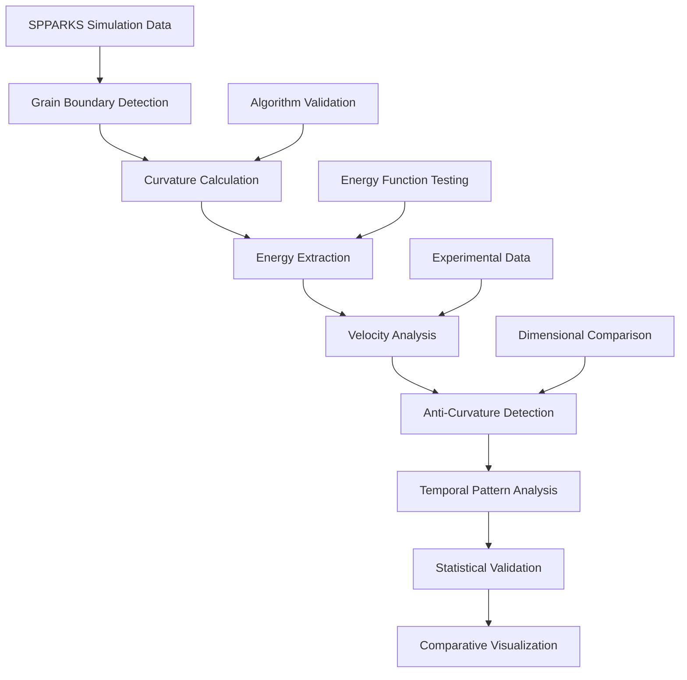

# Grain Boundary Velocity and Anti-Curvature Analysis Documentation

## Overview

This directory contains a comprehensive suite of Jupyter notebooks for analyzing grain boundary (GB) velocity and anti-curvature behavior in polycrystalline materials. These tools provide systematic analysis of how grain boundary energy anisotropy affects grain growth dynamics, enabling investigation of counter-intuitive grain boundary motion patterns that deviate from classical curvature-driven predictions within the VECTOR framework.

## Directory Structure

```
GB_velocity/
├── README.md                                                           # This documentation
├── 3D_GB_experimental_data.ipynb                                      # Experimental data analysis
├── 3D_GB_velocity_anti_curvature_iso.ipynb                           # 3D isotropic baseline analysis
├── 3D_GB_velocity_anti_curvature_I.ipynb                             # 3D inclination-only anisotropy
├── 3D_GB_velocity_anti_curvature_I_Ab.ipynb                          # 3D inclination with Well Energy
├── 3D_GB_velocity_anti_curvature_M.ipynb                             # 3D misorientation-only anisotropy
├── 3D_GB_velocity_anti_curvature_MI.ipynb                            # 3D full anisotropy analysis
├── 3D_GB_velocity_anti_curvature_MI_Ab.ipynb                         # 3D full anisotropy with Well Energy
├── 3D_GB_velocity_anti_curvature_MI_VECTOR.ipynb                     # 3D VECTOR algorithm validation
├── 3D_GB_velocity_anti_curvature_M_Ab.ipynb                          # 3D misorientation with Well Energy
├── 3D_GB_velocity_anti_curvature_iso_VECTOR.ipynb                    # 3D isotropic VECTOR validation
├── 3D_GB_velocity_anti_curvature_steady_state.ipynb                  # 3D steady-state analysis
├── 3D_GB_velocity_anti_curvature_steady_state_experiment.ipynb       # 3D experimental validation
├── GB_velocity_anti_curvature-iso.ipynb                              # 2D isotropic baseline analysis
├── GB_velocity_anti_curvature_I.ipynb                                # 2D inclination-only anisotropy
├── GB_velocity_anti_curvature_I_ab.ipynb                             # 2D inclination with Well Energy
├── GB_velocity_anti_curvature_M.ipynb                                # 2D misorientation-only anisotropy
├── GB_velocity_anti_curvature_MI.ipynb                               # 2D full anisotropy analysis
├── GB_velocity_anti_curvature_MI_ab.ipynb                            # 2D full anisotropy with Well Energy
├── GB_velocity_anti_curvature_M_ab.ipynb                             # 2D misorientation with Well Energy
├── IO_curvature_calculate_for_oneGB.ipynb                            # Algorithm validation notebook
├── anti_curvature_fraction_plot.ipynb                                # Comparative fraction analysis
└── verification_curvature_algorithm_3d.ipynb                         # 3D algorithm verification
```

## Workflow Overview

The grain boundary velocity analysis workflow follows this comprehensive pipeline:



## Scientific Background

### Anti-Curvature Phenomena
**Anti-curvature behavior** occurs when grain boundaries move opposite to the direction predicted by their curvature drive force. In normal grain growth, high-curvature boundaries should shrink and low-curvature boundaries should grow. However, in anisotropic systems, energy landscape variations can cause boundaries to exhibit counter-intuitive motion patterns.

### Energy Anisotropy Types
- **Isotropic (iso)**: No directional energy dependence - baseline reference system
- **Misorientation-only (M)**: Energy depends only on misorientation angle (f=1.0, t=0.0)
- **Inclination-only (I)**: Energy depends only on boundary plane orientation (f=0.0, t=1.0)
- **Full Anisotropy (MI)**: Energy depends on both misorientation and inclination parameters

### Energy Function Formulations
- **Cosine Energy Function (standard)**: Smooth, continuous energy variation with crystallographic parameters
- **Well Energy Function (_ab/_Ab variants)**: Discrete energy wells at specific crystallographic configurations, creating sharper energy minima and enhanced anisotropic effects

## File Descriptions

### 1. Algorithm Validation and Verification Tools

#### IO_curvature_calculate_for_oneGB.ipynb
**Purpose**: Single grain boundary curvature calculation validation for algorithm verification

**Key Features**:
- Simplified two-grain system analysis for clean validation environment
- Direct comparison of 2D linear smoothing vs 3D curvature calculation methods
- Temporal consistency verification for curvature evolution patterns
- Reference data generation for validating complex system analyses

**Usage**:
```python
# Validate curvature calculation on simple two-grain system
curvature_validation = validate_single_GB_curvature(
    simple_microstructure, time_series, method='linear_smoothing'
)
```

**Applications**:
- Algorithm accuracy verification before complex system analysis
- Method comparison between 2D and 3D calculation approaches
- Benchmark generation for curvature calculation validation

#### verification_curvature_algorithm_3d.ipynb
**Purpose**: Comprehensive 3D curvature algorithm verification and benchmarking

**Key Features**:
- 3D curvature calculation algorithm validation on known geometric systems
- Comparison with analytical solutions for spherical and cylindrical geometries
- Performance benchmarking for large-scale 3D microstructures
- Error analysis and convergence studies for 3D curvature methods

**Applications**:
- 3D algorithm validation before production analysis
- Performance optimization for large-scale 3D systems
- Accuracy assessment for complex 3D grain geometries

### 2. 2D Grain Boundary Analysis Suite

#### GB_velocity_anti_curvature-iso.ipynb
**Purpose**: 2D isotropic baseline analysis for reference behavior characterization

**Scientific Objectives**:
- Establish baseline grain boundary velocity-curvature relationships
- Validate normal curvature-driven grain growth behavior
- Provide reference dataset for anisotropic system comparison
- Quantify natural fluctuations in velocity-curvature correlations

**Key Features**:
- 2D linear smoothing curvature calculation with 5×5 kernel matrices
- Volume change velocity tracking with temporal filtering
- Statistical analysis of velocity-curvature correlations
- Quality filtering for grain boundary area and curvature thresholds

**Usage**:
```python
# Configure 2D isotropic analysis
case_name = "iso_20k_2D"
time_interval = 30
curvature_limit = 0.0182
area_limit = 100

# Execute velocity-curvature analysis
velocity_curvature_analysis_2D_iso(microstructure_data, energy_data, analysis_params)
```

#### GB_velocity_anti_curvature_M.ipynb / GB_velocity_anti_curvature_M_ab.ipynb
**Purpose**: 2D misorientation-dependent anisotropy analysis with energy function comparison

**Scientific Objectives**:
- Analyze effects of misorientation-dependent energy on grain boundary dynamics
- Compare Cosine Energy vs Well Energy function impacts on anti-curvature behavior
- Quantify misorientation-induced deviations from curvature-driven growth
- Validate energy function implementations in SPPARKS simulations

**Key Features**:
- Misorientation angle calculation with crystallographic symmetry operations
- Energy-dependent velocity analysis with anisotropic corrections
- Comparative analysis between standard and Well Energy formulations
- Statistical characterization of misorientation-dependent anti-curvature patterns

#### GB_velocity_anti_curvature_I.ipynb / GB_velocity_anti_curvature_I_ab.ipynb
**Purpose**: 2D inclination-dependent anisotropy analysis with energy function comparison

**Scientific Objectives**:
- Investigate boundary plane orientation effects on grain growth dynamics
- Analyze inclination-dependent energy landscape impacts on velocity-curvature relationships
- Compare energy function formulations for inclination anisotropy
- Characterize geometric effects on anti-curvature behavior

**Key Features**:
- Boundary plane normal calculation with 2D geometric analysis
- Inclination-dependent energy extraction and correlation analysis
- Temporal pattern analysis for inclination-induced anti-curvature events
- Energy landscape visualization for boundary orientation effects

#### GB_velocity_anti_curvature_MI.ipynb / GB_velocity_anti_curvature_MI_ab.ipynb
**Purpose**: 2D full anisotropy analysis combining misorientation and inclination effects

**Scientific Objectives**:
- Comprehensive analysis of combined misorientation and inclination anisotropy
- Investigation of coupled effects on grain boundary dynamics
- Full anisotropic energy landscape characterization
- Maximum anisotropy impact assessment on anti-curvature behavior

**Key Features**:
- Combined misorientation-inclination energy calculation
- Full 5-parameter grain boundary character analysis
- Complex energy landscape navigation and anti-curvature correlation
- Statistical validation of full anisotropic effects

### 3. 3D Grain Boundary Analysis Suite

#### 3D_GB_velocity_anti_curvature_iso.ipynb
**Purpose**: 3D isotropic baseline analysis with mean curvature calculations

**Scientific Objectives**:
- Establish 3D reference behavior for grain boundary dynamics
- Validate 3D curvature calculation methods with isotropic systems
- Compare 2D vs 3D grain boundary behavior in controlled systems
- Provide baseline for 3D anisotropic system validation

**Key Features**:
- 3D mean curvature calculation with 5×5×5 linear smoothing kernels
- 3D volume change tracking with periodic boundary conditions
- Dimensional comparison analysis for 2D vs 3D effects
- Enhanced statistical analysis for 3D grain boundary populations

**Technical Implementation**:
```python
# 3D curvature calculation with linear smoothing
smooth_class = Linear_3D.linear_class(nx, ny, nz, ng, cores, loop_times, P0, R)
smooth_class.linear_main("curvature")
curvature_3D = smooth_class.get_curvature()

# 3D velocity calculation with volume tracking
dV_3D = compute_dV_3D(microstructure_current, microstructure_next, GB_pairs)
velocity_3D = dV_3D / (GB_area * time_interval)
```

#### 3D_GB_velocity_anti_curvature_M.ipynb / 3D_GB_velocity_anti_curvature_M_Ab.ipynb
**Purpose**: 3D misorientation-dependent anisotropy analysis with enhanced energy function testing

**Scientific Objectives**:
- Extend misorientation anisotropy analysis to 3D systems
- Validate 3D crystallographic calculations with cubic symmetry operations
- Compare 3D energy function implementations (Cosine vs Well Energy)
- Analyze dimensional effects on misorientation-dependent anti-curvature

**Key Features**:
- 3D crystallographic orientation analysis with quaternion mathematics
- Enhanced misorientation calculation with 24-fold cubic symmetry
- 3D energy landscape analysis with complex boundary geometries
- Dimensional scaling analysis for misorientation effects

#### 3D_GB_velocity_anti_curvature_I.ipynb / 3D_GB_velocity_anti_curvature_I_Ab.ipynb
**Purpose**: 3D inclination-dependent anisotropy analysis with geometric complexity

**Scientific Objectives**:
- Investigate 3D boundary plane orientation effects on grain dynamics
- Analyze complex 3D geometric effects on inclination-dependent energy
- Validate 3D inclination calculations with normal vector analysis
- Characterize 3D geometric anisotropy impacts on anti-curvature

**Key Features**:
- 3D boundary plane normal calculation with gradient analysis
- Complex 3D geometric energy landscape characterization
- Enhanced inclination-dependent anti-curvature pattern analysis
- 3D visualization tools for boundary orientation effects

#### 3D_GB_velocity_anti_curvature_MI.ipynb / 3D_GB_velocity_anti_curvature_MI_Ab.ipynb
**Purpose**: 3D full anisotropy analysis with maximum complexity systems

**Scientific Objectives**:
- Complete 3D anisotropic grain boundary analysis
- Maximum anisotropy impact assessment in 3D systems
- Full 5-parameter grain boundary character distribution in 3D
- Comprehensive energy function validation in complex 3D environments

**Key Features**:
- Complete 3D crystallographic and geometric analysis
- Full anisotropic energy landscape navigation in 3D
- Complex anti-curvature pattern analysis with 3D temporal evolution
- Maximum anisotropy validation for materials design applications

### 4. Advanced Analysis and Validation Tools

#### 3D_GB_velocity_anti_curvature_steady_state.ipynb
**Purpose**: Long-term steady-state grain growth analysis with persistent anti-curvature characterization

**Scientific Objectives**:
- Analyze grain boundary behavior in steady-state growth regime
- Characterize persistent vs transient anti-curvature patterns
- Investigate long-term energy landscape effects on grain dynamics
- Validate steady-state grain growth models with anisotropic corrections

**Key Features**:
- Extended time series analysis for steady-state regime identification
- Persistent anti-curvature pattern classification and quantification
- Statistical convergence analysis for long-term grain boundary behavior
- Steady-state energy landscape characterization

#### 3D_GB_velocity_anti_curvature_steady_state_experiment.ipynb
**Purpose**: Experimental validation of steady-state analysis with real materials data

**Scientific Objectives**:
- Validate simulation predictions against experimental grain growth data
- Compare theoretical anti-curvature predictions with experimental observations
- Assess energy function accuracy using experimental validation
- Bridge computational predictions with materials science experiments

#### 3D_GB_experimental_data.ipynb
**Purpose**: Experimental data integration and validation framework

**Scientific Objectives**:
- Process and analyze experimental grain growth data for model validation
- Extract velocity-curvature relationships from experimental microstructures
- Compare experimental observations with simulation predictions
- Validate energy function formulations against real materials behavior

**Key Features**:
- Experimental data import and processing with DREAM.3D integration
- Real microstructure analysis with experimental time series data
- Statistical comparison between experimental and simulation results
- Materials science validation of computational predictions

**Technical Implementation**:
```python
# Experimental data processing
f = h5py.File(experimental_data_folder + "experimental_microstructure.dream3d", 'r')
experimental_microstructure = f['DataContainers']['ImageDataContainer']['CellData']['FeatureIds']

# Experimental velocity-curvature analysis
experimental_velocity_curvature_analysis(experimental_microstructure, time_intervals)
```

#### 3D_GB_velocity_anti_curvature_iso_VECTOR.ipynb / 3D_GB_velocity_anti_curvature_MI_VECTOR.ipynb
**Purpose**: VECTOR algorithm validation and performance comparison

**Scientific Objectives**:
- Validate VECTOR algorithm accuracy against established methods
- Performance benchmarking for computational efficiency assessment
- Algorithm optimization for large-scale 3D analysis
- Method verification for production analysis workflows

**Key Features**:
- Direct comparison between VECTOR and traditional analysis methods
- Computational performance benchmarking with timing analysis
- Accuracy assessment with known reference solutions
- Algorithm optimization recommendations for production use

### 5. Comparative Analysis and Statistical Tools

#### anti_curvature_fraction_plot.ipynb
**Purpose**: Comprehensive comparative analysis across all anisotropy types and energy functions

**Scientific Objectives**:
- Statistical comparison of anti-curvature fractions across all system types
- Energy function impact assessment through systematic comparison
- Anisotropy type ranking for anti-curvature susceptibility
- Publication-quality comparative visualization generation

**Key Features**:
- Automated data aggregation from all analysis notebooks
- Statistical significance testing for anti-curvature fraction differences
- Comprehensive visualization suite for comparative analysis
- Publication-quality figure generation with error analysis

**Usage**:
```python
# Comprehensive comparative analysis
anti_curvature_comparison = compare_all_systems(
    systems=['iso', 'M', 'I', 'MI'],
    energy_functions=['cosine', 'well'],
    dimensions=['2D', '3D']
)

# Generate comparative plots
plot_anti_curvature_fractions(anti_curvature_comparison, save_path='./comparative_analysis/')
```

## Technical Specifications

### Computational Framework

#### Core Analysis Pipeline
```python
# Standard analysis workflow for all notebooks
def grain_boundary_velocity_analysis(microstructure_data, energy_data, analysis_params):
    # 1. Grain boundary detection and quality filtering
    GB_sites = detect_grain_boundaries(microstructure_data, area_threshold=100)
    
    # 2. Curvature calculation with appropriate method
    if analysis_params['dimension'] == '2D':
        curvature = calculate_curvature_2D_linear_smoothing(microstructure_data)
    else:
        curvature = calculate_curvature_3D_mean(microstructure_data)
    
    # 3. Energy extraction with anisotropy handling
    GB_energy = extract_grain_boundary_energy(energy_data, GB_sites, anisotropy_type)
    
    # 4. Velocity calculation with temporal tracking
    velocity = calculate_velocity_volume_change(microstructure_time_series, time_interval)
    
    # 5. Anti-curvature detection and pattern analysis
    anti_curvature_events = detect_anti_curvature_patterns(velocity, curvature, temporal_filter)
    
    # 6. Statistical analysis and visualization
    statistical_analysis_and_visualization(velocity, curvature, anti_curvature_events)
```

#### Anisotropy Parameter Configuration
| Anisotropy Type | f-parameter | t-parameter | Energy Dependence |
|----------------|-------------|-------------|-------------------|
| Isotropic (iso) | 0.0 | 0.0 | Constant energy |
| Misorientation (M) | 1.0 | 0.0 | Misorientation angle only |
| Inclination (I) | 0.0 | 1.0 | Boundary plane orientation only |
| Full (MI) | 1.0 | 1.0 | Both misorientation and inclination |

#### Energy Function Specifications
```python
# Cosine Energy Function (standard)
def cosine_energy_function(misorientation_angle, inclination_angle, f_param, t_param):
    energy = base_energy * (1 + f_param * cos(misorientation_angle) + t_param * cos(inclination_angle))
    return energy

# Well Energy Function (_ab/_Ab variants)
def well_energy_function(misorientation_angle, inclination_angle, f_param, t_param):
    # Discrete energy wells at specific crystallographic configurations
    energy = base_energy * well_function(misorientation_angle, inclination_angle, f_param, t_param)
    return energy
```

### Performance Characteristics

#### Computational Requirements
| System Size | Memory (GB) | Processing Time | CPU Cores | Storage (GB) |
|-------------|-------------|-----------------|-----------|--------------|
| 2D 512² | 4-8 | 2-4 hours | 8-16 | 1-2 |
| 3D 128³ | 8-16 | 4-8 hours | 16-32 | 2-5 |
| 3D 256³ | 32-64 | 8-16 hours | 32-64 | 10-20 |
| 3D 512³ | 128-256 | 24-48 hours | 64-128 | 50-100 |

#### Analysis Parameters
```python
# Standard analysis parameters
analysis_params = {
    'time_interval': 30,              # Time steps between velocity calculations
    'curvature_limit': 0.0182,        # Minimum curvature threshold for analysis
    'area_limit': 100,                # Minimum grain boundary area threshold
    'temporal_filter_window': 5,      # Rolling window for pattern analysis
    'statistical_confidence': 0.99,   # Confidence level for significance testing
    'parallel_cores': 32,             # CPU cores for parallel processing
    'memory_limit': '64GB'            # Memory allocation limit
}
```

### Data Formats and Integration

#### SPPARKS Data Integration
```python
# Standard SPPARKS data format
microstructure_file = "simulation_microstructure.npy"  # Shape: (time_steps, x, y, z)
energy_file = "simulation_energy.npy"                  # Shape: (time_steps, x, y, z)

# HiPerGator dataset configuration
data_folder = "/blue/michael.tonks/lin.yang/VECTOR_data/"
case_configurations = {
    'iso': "isotropic_system_data.npy",
    'M': "misorientation_anisotropy_data.npy", 
    'I': "inclination_anisotropy_data.npy",
    'MI': "full_anisotropy_data.npy"
}
```

#### Output Data Structures
```python
# Analysis results data structure
analysis_results = {
    'GB_velocity_list': [],           # All grain boundary velocities
    'GB_curvature_list': [],          # All grain boundary curvatures
    'GB_energy_list': [],             # All grain boundary energies
    'anti_curvature_events': {},      # Anti-curvature event database
    'temporal_patterns': {},          # Temporal pattern classification
    'statistical_metrics': {},       # Statistical analysis results
    'visualization_data': {}         # Data for publication-quality plots
}
```

## Dependencies

### Required Python Packages
```bash
pip install numpy matplotlib scipy tqdm numba
pip install h5py  # For experimental data processing
pip install multiprocessing  # For parallel analysis
```

### VECTOR Framework Modules
- `myInput`: Input parameter management and boundary condition utilities
- `post_processing`: Core microstructure analysis and grain boundary processing
- `PACKAGE_MP_3DLinear`: 3D linear algebra operations for curvature calculation
- `PACKAGE_MP_3DVertex`: 3D vertex analysis for complex grain boundary geometries

### Optional Dependencies
```bash
pip install jupyter ipywidgets  # For interactive notebook analysis
pip install plotly  # For advanced 3D visualization
pip install scikit-image  # For enhanced image processing
```

## Usage Examples

### Basic Anti-Curvature Analysis Workflow
```python
# 1. Configure analysis parameters
case_name = "MI_20k_3D"
anisotropy_type = "MI"  # Full anisotropy
energy_function = "well"  # Well Energy function
dimension = "3D"

# 2. Load simulation data
microstructure_data = np.load(data_folder + f"{case_name}_microstructure.npy")
energy_data = np.load(data_folder + f"{case_name}_energy.npy")

# 3. Execute comprehensive analysis
results = grain_boundary_velocity_analysis(
    microstructure_data, energy_data, 
    anisotropy_type=anisotropy_type,
    energy_function=energy_function,
    dimension=dimension
)

# 4. Generate publication-quality visualization
plot_velocity_curvature_correlation(results, save_path=f"./figures/{case_name}_analysis.png")
```

### Comparative Analysis Across Energy Functions
```python
# Compare Cosine vs Well Energy functions
energy_functions = ['cosine', 'well']
anisotropy_types = ['iso', 'M', 'I', 'MI']

comparative_results = {}
for energy_func in energy_functions:
    for anisotropy in anisotropy_types:
        case_name = f"{anisotropy}_{energy_func}_20k"
        results = run_full_analysis(case_name, anisotropy, energy_func)
        comparative_results[f"{anisotropy}_{energy_func}"] = results

# Generate comparative statistics
comparative_statistics = analyze_energy_function_effects(comparative_results)
plot_comparative_anti_curvature_fractions(comparative_statistics)
```

### Algorithm Validation Workflow
```python
# 1. Validate curvature calculation on simple systems
validation_results = validate_curvature_algorithms(
    simple_two_grain_system, 
    methods=['linear_smoothing_2D', 'mean_curvature_3D']
)

# 2. Compare with analytical solutions
analytical_comparison = compare_with_analytical_solutions(
    spherical_grain_system, cylindrical_grain_system
)

# 3. Performance benchmarking
performance_metrics = benchmark_algorithm_performance(
    large_scale_systems, cpu_cores=[16, 32, 64]
)
```

## HPC Cluster Considerations

### Storage Requirements
- **Input datasets**: 10-100 GB (SPPARKS simulation results)
- **Analysis output**: 1-10 GB (statistical results and visualizations)
- **Temporary files**: 20-50% of input size during processing
- **Comparative analysis**: Additional 5-20 GB for cross-system comparison

### Memory Requirements
- **2D analysis**: 4-16 GB for typical grain counts (5k-20k grains)
- **3D analysis**: 16-128 GB for realistic 3D systems
- **Comparative analysis**: 2-5× individual analysis requirements
- **Parallel processing**: Memory × CPU cores for optimal performance

### Recommended HPC Settings
```bash
# SLURM example for large-scale 3D anti-curvature analysis
#SBATCH --nodes=1
#SBATCH --ntasks-per-node=64
#SBATCH --mem=256GB
#SBATCH --time=24:00:00
#SBATCH --partition=standard

# Load required modules
module load python/3.9
module load numpy/1.21
module load matplotlib/3.5
```

## Scientific Applications

### Materials Science Research
- **Microstructure Evolution**: Understanding how energy anisotropy affects grain growth kinetics
- **Texture Development**: Analyzing crystallographic texture evolution through anti-curvature mechanisms
- **Property Optimization**: Controlling grain boundary character distribution for enhanced properties
- **Alloy Design**: Predicting microstructural evolution in anisotropic materials systems

### Computational Materials Science
- **Model Validation**: Verifying Monte Carlo simulation accuracy against experimental data
- **Algorithm Development**: Testing and optimizing new energy function implementations
- **Scale Effects**: Understanding energy function consistency across length and time scales
- **Method Comparison**: Evaluating different computational approaches for grain boundary analysis

### Energy Function Development
- **Anisotropic Model Testing**: Systematic validation of crystallographic energy formulations
- **Energy Function Ranking**: Comparative assessment of different energy function approaches
- **Parameter Optimization**: Fine-tuning anisotropy parameters for specific materials applications
- **Implementation Verification**: Ensuring correct energy function implementation in simulation codes

## Troubleshooting

### Common Issues

#### Memory Errors During Large 3D Analysis
```
MemoryError: Unable to allocate array for 3D curvature calculation
```
**Solution**: Reduce domain size, increase memory allocation, or implement chunked processing

#### Curvature Calculation Convergence Issues
```
Warning: Linear smoothing did not converge within iteration limit
```
**Solution**: Increase iteration limits, adjust convergence criteria, or check input data quality

#### Anti-Curvature Detection Sensitivity
```
Warning: Very low anti-curvature fraction detected - check thresholds
```
**Solution**: Adjust curvature_limit, area_limit, or temporal_filter_window parameters

#### Energy Function Implementation Errors
```
ValueError: Energy calculation produced invalid results
```
**Solution**: Verify anisotropy parameters, check energy function implementation, validate input data

### Performance Optimization

#### For Large-Scale 3D Analysis
1. Use parallel processing with appropriate CPU core allocation
2. Implement memory-efficient data structures for large datasets
3. Optimize I/O operations with fast storage systems
4. Use chunked processing for memory-limited systems

#### For Comparative Studies
1. Standardize analysis parameters across all systems
2. Implement automated result aggregation workflows
3. Use consistent data validation across all analyses
4. Generate standardized visualization outputs

## Integration with SPPARKS Framework

### Required SPPARKS Configuration
```bash
# SPPARKS input configuration for anti-curvature analysis
app_style potts/neighonly
dimension 3
lattice sc/26n 1.0
region domain block 0 256 0 256 0 256
create_box domain
create_sites box
set site range 1 256 range 1 256 range 1 256

# Energy function configuration
potts/energy anisotropy read_energy_file energy_matrix.txt
```

### Output Data Requirements
The analysis tools require specific SPPARKS output:
- **Time-series microstructure data**: Grain ID evolution over time
- **Energy data**: Corresponding energy per site for anisotropy analysis
- **Consistent timestep intervals**: Regular sampling for velocity calculations
- **Boundary condition information**: Periodic boundary handling

### Validation Protocol
1. **Generate reference simulations** with known analytical solutions
2. **Run systematic parameter studies** across anisotropy types and energy functions
3. **Validate against experimental data** where available
4. **Perform statistical significance testing** on anti-curvature observations
5. **Document computational reproducibility** for scientific publication

## Contributing

When modifying these analysis tools:

1. **Maintain computational accuracy** in all curvature and velocity calculations
2. **Preserve statistical rigor** in anti-curvature detection and analysis
3. **Document performance characteristics** for new analysis algorithms
4. **Test across multiple anisotropy types** and energy functions
5. **Update documentation** with methodology changes and new capabilities
6. **Ensure compatibility** with existing SPPARKS simulation workflows
7. **Validate results** against known reference solutions when possible

## References

1. **SPPARKS Documentation**: https://spparks.sandia.gov/
2. **VECTOR Framework**: Internal grain boundary analysis and curvature calculation tools
3. **Grain Growth Theory**: Humphreys & Hatherly, "Recrystallization and Related Annealing Phenomena"
4. **Anti-Curvature Research**: Literature on abnormal grain boundary motion in anisotropic systems
5. **Monte Carlo Methods**: Landau & Binder, "A Guide to Monte Carlo Simulations in Statistical Physics"
6. **Crystallographic Analysis**: Randle & Engler, "Introduction to Texture Analysis"
7. **Statistical Analysis**: Taylor, "An Introduction to Error Analysis"

---

For questions or issues related to grain boundary velocity and anti-curvature analysis, contact the VECTOR development team or refer to the comprehensive inline documentation within each analysis notebook.
