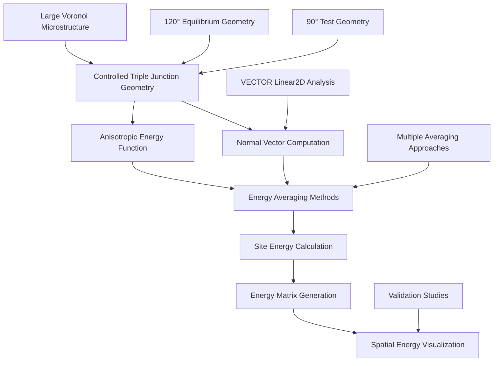

# Triple Junction Site Energy Calculation Documentation

## Overview

This directory contains specialized tools for triple junction site energy calculation and validation within the VECTOR framework for Monte Carlo Potts model simulations. These utilities focus on anisotropic grain boundary energy function development, energy averaging method comparison, and triple junction equilibrium analysis for advanced grain growth modeling.

## Directory Structure

```
TJ_site_energy_calculation/
├── README.md                    # This documentation
├── Get_TJ_Energy_Potts.py      # Main triple junction energy calculation script
├── VoronoiIC_512_elong.init    # Large-scale Voronoi microstructure test case
├── colorbar.png                # Generated energy distribution visualization
└── .ipynb_checkpoints/         # Backup files (development artifacts)
```

## Scientific Framework Overview

The triple junction energy analysis workflow encompasses theoretical validation and computational verification:



## File Descriptions

### 1. Get_TJ_Energy_Potts.py
**Purpose**: Comprehensive triple junction site energy calculation and validation framework

**Key Features**:
- **Multiple Energy Averaging Methods**: ave, sum, min, max, consMin, consMax approaches
- **Anisotropic Energy Function**: Cosine-based energy with orientation dependence E(θ) = 1 + δ*cos(m*θ)
- **VECTOR Linear2D Integration**: Robust grain boundary normal vector computation
- **Controlled Test Geometries**: 90° and 120° triple junction configurations for validation
- **Energy Matrix Visualization**: Spatial energy distribution analysis and plotting

**Scientific Framework**:
```python
# Anisotropic energy function with configurable parameters
energy = 1 + delta * cos(m * theta)  # delta=0.6, m=2 (default)

# Multiple energy averaging approaches for comparison
# - Summation Energy (active): Total neighbor energy contribution
# - Average Energy: Arithmetic mean of center and neighbors  
# - Min/Max Energy: Extreme energy selection for stability analysis
# - Conservative Methods: Enhanced averaging with grain-wise processing
```

**Core Functions**:
- `get_2d_ic1(nx,ny)`: Generate 90° non-equilibrium triple junction test geometry
- `get_2d_ic2(nx,ny)`: Generate 120° equilibrium triple junction configuration  
- `energy_function(normals, delta, m)`: Anisotropic grain boundary energy calculation
- `calculate_energy(P, i, j)`: Comprehensive site energy with multiple averaging methods
- `get_inclination(P, i, j)`: VECTOR Linear2D normal vector computation

**Usage Examples**:
```python
# Generate controlled triple junction geometry
nx, ny = 10, 10
ic90 = get_2d_ic1(nx, ny)        # 90° test configuration
ic120 = get_2d_ic2(nx, ny)       # 120° equilibrium configuration

# Calculate site energy at triple junction
x, y = 4, 4                      # Triple junction coordinates
energy = calculate_energy(ic90, x, y)  # Site energy calculation

# Generate energy matrix for spatial analysis
eng_matrix = np.zeros((nx, ny))
for i in range(4, 6):
    for j in range(4, 6):
        eng_matrix[i][j] = calculate_energy(ic90, i, j)
```

**Target Applications**:
- Monte Carlo Potts model energy function validation
- Triple junction equilibrium angle verification studies
- Energy averaging method sensitivity analysis
- Anisotropic grain boundary energy model development

### 2. VoronoiIC_512_elong.init
**Purpose**: Large-scale realistic polycrystalline microstructure for energy validation

**Key Features**:
- **Domain Size**: 512×512 grid with complex grain boundary network
- **Grain Population**: ~500+ grains for statistical significance
- **Voronoi Tessellation**: Realistic polycrystalline grain structure
- **Euler Angles**: Complete crystallographic orientation assignment
- **SPPARKS Format**: Standard initialization file format for Monte Carlo simulations

**File Structure**:
```
# SPPARKS initialization format
Values
site_id grain_id phi1 Phi phi2
1 168 1.5707963267948966 0.0 0.0
2 168 1.5707963267948966 0.0 0.0
...
```

**Scientific Applications**:
- Large-scale energy calculation validation with realistic microstructures
- Statistical analysis of energy averaging methods across complex geometries
- Computational performance testing for energy calculation algorithms
- Validation of triple junction energy methods in realistic grain networks

**Usage Integration**:
```python
# Load large-scale microstructure for validation
filename = "VoronoiIC_512_elong.init"
nx, ny, ng = 512, 512, 512
ic_large, _ = myInput.init2IC(nx, ny, ng, filename, "./")
ic_large = ic_large[:,:,0]

# Apply energy analysis to realistic microstructure
energy_validation = calculate_energy(ic_large, x, y)
```

### 3. colorbar.png
**Purpose**: Generated energy distribution visualization output

**Key Features**:
- **High-Resolution Output**: 400 DPI publication-quality visualization
- **Energy Colormap**: Grayscale representation of spatial energy distribution
- **Quantitative Scale**: Horizontal colorbar for energy magnitude reference
- **Scientific Validation**: Visual verification of energy calculation algorithms

**Generation Process**:
```python
# Energy matrix visualization
plt.imshow(eng_matrix, cmap='gray_r', vmin=0, vmax=3)
plt.colorbar(orientation='horizontal')
plt.savefig('colorbar', dpi=400, bbox_inches='tight')
```

**Scientific Interpretation**:
- **Energy Hotspots**: High-energy regions indicating unstable configurations
- **Energy Gradients**: Spatial energy variations driving grain boundary motion
- **Triple Junction Energy**: Validation of energy calculation at critical sites
- **Method Comparison**: Visual comparison of different energy averaging approaches

## Technical Specifications

### Computational Requirements

| Analysis Type | Domain Size | Memory (GB) | Processing Time | Cores |
|---------------|-------------|-------------|-----------------|-------|
| Small Test Cases | 10×10 | <0.1 | ~1 minute | 1 |
| Medium Validation | 64×64 | 0.1-0.5 | ~10 minutes | 1 |
| Large Microstructure | 512×512 | 2-5 | ~1 hour | 1-4 |
| Energy Matrix | Variable | Variable | Linear scaling | 1 |

### Energy Function Parameters

#### Anisotropic Energy Configuration
```python
# Standard anisotropic parameters
delta = 0.6          # Anisotropy strength (0.0 = isotropic, 1.0 = maximum)
m = 2               # Periodicity parameter (2 = four-fold symmetry)
reference = [1,0]   # Reference direction for energy calculation

# Energy range and characteristics
E_min = 1 - delta   # Minimum energy (0.4 for delta=0.6)
E_max = 1 + delta   # Maximum energy (1.6 for delta=0.6)
E_avg = 1.0         # Average energy (isotropic baseline)
```

#### VECTOR Linear2D Parameters
```python
# Normal vector computation configuration
loop_times = 5      # Iterative refinement cycles
ng = 512           # Maximum grain number allocation
cores = 1          # Single-core processing for individual sites
```

### File Formats and Data Structures

#### SPPARKS Initialization File (.init)
```
# Comment line (ignored by SPPARKS)
Values

site_id grain_id phi1 Phi phi2
1 168 1.5707963267948966 0.0 0.0
2 168 1.5707963267948966 0.0 0.0
...
```

#### Energy Matrix Output
```python
# 2D numpy array structure
eng_matrix = np.zeros((nx, ny))  # Spatial energy distribution
# Values represent calculated site energies
# Coordinates correspond to microstructure positions
```

## Scientific Methodology

### Triple Junction Theory

#### Equilibrium Angle Relationships
For isotropic grain boundary energy γ, triple junction equilibrium requires:
```
γ₁₂/sin(θ₃) = γ₁₃/sin(θ₂) = γ₂₃/sin(θ₁)
```

Where θ₁, θ₂, θ₃ are the three angles at the triple junction.

For equal energy boundaries (γ₁₂ = γ₁₃ = γ₂₃):
- **Equilibrium angles**: θ₁ = θ₂ = θ₃ = 120°
- **Energy minimization**: Triple junction achieves minimum total energy
- **Force balance**: Vector sum of boundary tensions equals zero

#### Anisotropic Effects
With anisotropic energy E(θ) = 1 + δ*cos(m*θ):
- **Orientation Dependence**: Energy varies with grain boundary inclination
- **Equilibrium Deviation**: Triple junction angles deviate from 120°
- **Energy Landscape**: Complex energy surfaces with multiple local minima
- **Validation Requirement**: Computational methods must capture anisotropic effects

### Energy Averaging Methods

#### 1. Summation Energy (Active Method)
**Mathematical Framework**:
```
E_site = E_center + Σ(E_neighbor_grain_i)
```
**Scientific Justification**:
- Accounts for all local energy contributions
- Preserves energy conservation in Monte Carlo dynamics
- Enables realistic energy landscape for grain growth simulation

#### 2. Average Energy Method
**Mathematical Framework**:
```
E_site = (E_center + Σ(E_neighbor_i)/N_neighbors) / (N_grains + 1)
```
**Applications**:
- Balanced energy averaging for moderate anisotropy effects
- Smooth energy transitions for stable grain growth
- Comparative studies with summation method

#### 3. Minimum/Maximum Energy Methods
**Mathematical Framework**:
```
E_site = min(E_all_neighbors)  # or max(E_all_neighbors)
```
**Applications**:
- Energy minimization and stability analysis
- Extreme energy configuration studies
- Instability and abnormal growth investigation

#### 4. Conservative Methods
**Mathematical Framework**:
```
E_site = enhanced_min/max_with_grain_averaging
```
**Applications**:
- Stable energy calculation for complex geometries
- Reduced numerical sensitivity to local fluctuations
- Large-scale simulation energy calculation

## Validation and Verification

### Test Case Validation

#### 90° Triple Junction (Non-Equilibrium)
```python
ic90 = get_2d_ic1(10, 10)  # Generate test geometry
```
**Expected Results**:
- **High Energy**: Non-equilibrium configuration with elevated energy
- **Energy Gradients**: Strong gradients driving toward equilibrium
- **Method Sensitivity**: Different averaging methods show distinct responses

#### 120° Triple Junction (Equilibrium)
```python
ic120 = get_2d_ic2(10, 10)  # Generate equilibrium geometry
```
**Expected Results**:
- **Lower Energy**: Near-equilibrium configuration with reduced energy
- **Energy Stability**: Minimal gradients indicating equilibrium approach
- **Isotropic Validation**: Energy approaches theoretical equilibrium values

### Large-Scale Validation
```python
# Load realistic microstructure
ic_large = load_voronoi_microstructure("VoronoiIC_512_elong.init")
```
**Validation Criteria**:
- **Statistical Consistency**: Energy distributions match theoretical predictions
- **Computational Accuracy**: Results independent of domain discretization
- **Method Convergence**: Different averaging methods converge for large systems
- **Performance Scaling**: Linear computational scaling with domain size

## Usage Examples

### Basic Triple Junction Analysis
```python
#!/usr/bin/env python3
import numpy as np
import matplotlib.pyplot as plt

# Generate controlled test geometry
nx, ny = 10, 10
ic90 = get_2d_ic1(nx, ny)       # 90° test case

# Calculate energy at triple junction
x, y = 4, 4                     # Triple junction location
energy = calculate_energy(ic90, x, y)
print(f"Triple junction energy: {energy}")

# Generate energy matrix
eng_matrix = np.zeros((nx, ny))
for i in range(4, 6):
    for j in range(4, 6):
        eng_matrix[i][j] = calculate_energy(ic90, i, j)

# Visualize energy distribution  
plt.imshow(eng_matrix, cmap='gray_r')
plt.colorbar()
plt.title('Triple Junction Energy Distribution')
plt.savefig('energy_analysis.png', dpi=300)
```

### Energy Method Comparison Study
```python
# Compare different energy averaging methods
methods = ['sum', 'ave', 'min', 'max']
results = {}

for method in methods:
    # Modify active energy method in calculate_energy()
    energy = calculate_energy(ic90, 4, 4)
    results[method] = energy
    print(f"{method} method energy: {energy}")

# Analysis of method sensitivity
energy_range = max(results.values()) - min(results.values())
print(f"Energy method sensitivity: {energy_range}")
```

### Large-Scale Validation Study
```python
# Load large microstructure
filename = "VoronoiIC_512_elong.init"
ic_large, _ = myInput.init2IC(512, 512, 512, filename, "./")
ic_large = ic_large[:,:,0]

# Statistical energy analysis
sample_energies = []
for i in range(50, 450, 50):  # Sample across domain
    for j in range(50, 450, 50):
        energy = calculate_energy(ic_large, i, j)
        sample_energies.append(energy)

# Statistical validation
mean_energy = np.mean(sample_energies)
std_energy = np.std(sample_energies)
print(f"Statistical validation: μ={mean_energy:.3f}, σ={std_energy:.3f}")
```

## Integration with VECTOR Framework

### Required VECTOR Modules
```python
import PACKAGE_MP_Linear as Linear_2D      # 2D linear algebra operations
import PACKAGE_MP_Vertex as Vertex_2D      # 2D vertex operations  
import myInput                             # Input parameter management
```

### VECTOR Linear2D Integration
```python
# Normal vector computation using VECTOR framework
def get_inclination(P, i, j, loop_times=5, ng=512):
    # Initialize VECTOR Linear2D class
    test1 = Linear_2D.linear_class(nx, ny, ng, cores, loop_times, P0, R)
    
    # Compute normal vector at specified location
    normal = test1.linear_one_normal_vector_core([i, j])
    
    # Coordinate transformation and normalization
    normal = np.array([-normal[1], -normal[0]])
    return normal / np.linalg.norm(normal)
```

### Energy Function Integration
```python
# Anisotropic energy calculation
def energy_function(normals, delta=0.6, m=2):
    refer = np.array([1,0])  # Reference direction
    theta_rad = math.acos(round(np.array(normals).dot(refer), 5))
    return 1 + delta * math.cos(m * theta_rad)
```

## Troubleshooting

### Common Issues

#### Normal Vector Computation Errors
```
IndexError: array index out of bounds
```
**Solution**: Ensure site coordinates (i,j) are within valid bounds with border margins

#### Energy Calculation Convergence
```
Warning: Energy calculation may not have converged
```
**Solution**: Increase loop_times parameter for VECTOR Linear2D computation

#### Memory Issues with Large Microstructures
```
MemoryError: Unable to allocate array
```
**Solution**: Reduce ng parameter or process microstructure in smaller regions

### Performance Optimization

#### For Large Domains
1. **Batch Processing**: Calculate energies in spatial regions rather than individual sites
2. **Memory Management**: Use efficient array operations and memory allocation
3. **Parallel Processing**: Extend to multi-core processing for large-scale analysis
4. **Caching**: Store computed normal vectors for repeated energy calculations

#### For High-Precision Analysis
1. **Convergence Testing**: Validate loop_times parameter for accuracy requirements
2. **Numerical Precision**: Use appropriate floating-point precision for energy calculations
3. **Boundary Handling**: Ensure proper treatment of domain boundaries
4. **Energy Conservation**: Validate total energy conservation in system

## Scientific Applications

### Research Areas

#### Triple Junction Physics
- **Equilibrium Angle Studies**: Validation of Young's equation for complex systems
- **Anisotropic Effects**: Investigation of crystallographic influences on equilibrium
- **Energy Landscape Analysis**: Characterization of energy surfaces near triple junctions
- **Dynamic Behavior**: Energy evolution during grain growth processes

#### Monte Carlo Model Development
- **Energy Function Validation**: Testing of anisotropic energy formulations
- **Algorithm Verification**: Validation of energy calculation methods
- **Method Comparison**: Systematic comparison of energy averaging approaches
- **Computational Optimization**: Performance analysis for large-scale simulations

#### Materials Science Applications
- **Grain Growth Modeling**: Realistic energy functions for microstructure evolution
- **Texture Development**: Anisotropic energy effects on crystallographic texture
- **Interface Energy**: Experimental validation of computed grain boundary energies
- **Polycrystal Properties**: Microstructure-property relationships through energy analysis

## Contributing

### Development Guidelines
1. **Maintain Scientific Accuracy**: Preserve physical validity of energy calculations
2. **Document Modifications**: Update documentation for algorithm changes
3. **Validate Changes**: Test modifications against known analytical solutions
4. **Performance Monitoring**: Ensure computational efficiency for large systems

### Testing Protocol
1. **Unit Testing**: Validate individual function components
2. **Integration Testing**: Test VECTOR framework compatibility
3. **Validation Testing**: Compare against theoretical solutions
4. **Performance Testing**: Monitor computational scaling and efficiency

## References

1. **Triple Junction Theory**: Gottstein, G., "Physical Foundations of Materials Science"
2. **Monte Carlo Methods**: Landau & Binder, "A Guide to Monte Carlo Simulations in Statistical Physics"
3. **Grain Boundary Energy**: Read, W.T. & Shockley, W., "Dislocation Models of Crystal Grain Boundaries"
4. **VECTOR Framework**: Internal documentation for linear algebra and vertex operations
5. **Anisotropic Energy**: Morawiec, A., "Orientations and Rotations: Computations in Crystallographic Textures"
6. **Young's Equation**: Herring, C., "Some Theorems on the Free Energies of Crystal Surfaces"

---

For detailed questions about triple junction energy calculation, energy averaging methods, or integration with the VECTOR framework, refer to the comprehensive inline documentation within the Get_TJ_Energy_Potts.py script or contact the VECTOR development team.
