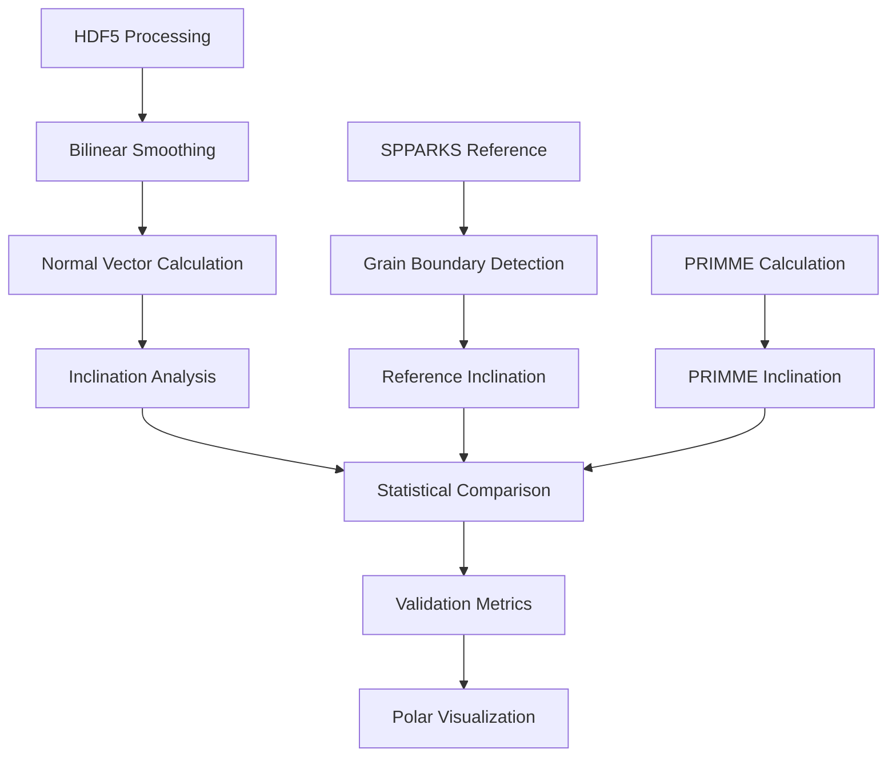

# PRIMME Inclination Analysis Documentation

## Overview

This directory contains a comprehensive suite of tools for grain boundary inclination vector analysis and validation within the VECTOR framework. These utilities enable rigorous comparison between SPPARKS Monte Carlo simulations, PRIMME (Parallel Runge-Kutta-based Implicit Multi-physics Multi-scale Engine) calculations, and phase field simulation results, providing critical validation for computational grain growth methodologies.

## Directory Structure

```
calculate_inclination/
├── README.md                                   # This comprehensive documentation
├── calculate_inclination_PRIMME.py            # Core PRIMME validation processor
├── calculate_inclination_PRIMME_hipergator.py # HPC-optimized batch processor
├── calculate_inclination_example.py           # Basic example script for inclination analysis
├── compare_inclination_PRIMME.py              # Statistical comparison engine
├── compare_inclination_PRIMME_hipergator.py   # HPC statistical analysis
├── calculate_inclination_PRIMME_hipergator.ipynb # Interactive analysis notebook
├── input/                                      # Sample input data and test cases
│   ├── PolyIC.init                            # Polycrystal initialization file
│   └── s1400poly1_t0.init                     # SPPARKS simulation initialization
└── output/                                     # Generated results and analysis data
    └── total_site.txt                          # Summary statistics output
```

## Scientific Context

### Grain Boundary Inclination Validation

The inclination vector analysis framework addresses a fundamental challenge in computational materials science: validating that different simulation methodologies produce equivalent grain boundary characteristics. This is critical for:

- **Method Validation**: Ensuring PRIMME calculations match established SPPARKS results
- **Algorithm Development**: Verifying new computational approaches against known benchmarks
- **Scientific Rigor**: Providing quantitative metrics for simulation accuracy
- **Model Selection**: Choosing appropriate methods for specific material systems

### Theoretical Foundation

**Inclination Vector Definition**:
The grain boundary inclination vector **n̂** represents the orientation of the grain boundary plane in 3D space, calculated as the normal vector to the local interface between adjacent grains.

**Statistical Validation Approach**:
- **Angular Distribution Analysis**: Compare histograms of inclination angles
- **Polar Coordinate Mapping**: θ (polar) and φ (azimuthal) angle distributions
- **Statistical Metrics**: Kolmogorov-Smirnov tests, correlation coefficients
- **Visual Validation**: Polar plots and distribution overlays

## Workflow Overview

The PRIMME validation workflow follows this analytical pipeline:



## File Descriptions

### 1. calculate_inclination_PRIMME.py
**Purpose**: Core processor for PRIMME inclination vector validation against phase field data

**Key Features**:
- **HDF5 Data Processing**: Efficient handling of large phase field datasets
- **Bilinear Smoothing**: Advanced smoothing algorithms for accurate normal calculation
- **Performance Monitoring**: Memory usage and execution time tracking
- **Robust Error Handling**: Comprehensive validation and recovery mechanisms

**Core Algorithm**:
```python
# 1. Load and process phase field data
phase_field_data = load_hdf5_timeseries(data_path)

# 2. Apply bilinear smoothing for numerical stability
smoothed_data = bilinear_smoothing(phase_field_data, smoothing_params)

# 3. Calculate grain boundary normal vectors
normal_vectors = calculate_gb_normals(smoothed_data)

# 4. Extract inclination vectors and statistical metrics
inclination_data = analyze_inclination_distribution(normal_vectors)
```

**Input Requirements**:
- Phase field simulation HDF5 files
- VECTOR framework configuration parameters
- Memory and performance optimization settings

**Output Products**:
- Inclination angle distributions (θ, φ coordinates)
- Statistical validation metrics
- Performance benchmarks and memory usage reports
- Processed data arrays for comparative analysis

### 2. calculate_inclination_PRIMME_hipergator.py
**Purpose**: HPC-optimized version for large-scale batch processing on HiPerGator cluster

**Key Features**:
- **Blue File System Integration**: Optimized I/O for HPC storage systems
- **Parallel Processing**: Multi-core utilization for computational efficiency
- **SLURM Integration**: Batch job management and resource allocation
- **Error Recovery**: Robust handling of cluster-specific issues

**HPC Optimizations**:
- Memory-mapped file access for large datasets
- Chunked processing to fit within node memory limits
- Parallel normal vector calculation across grain boundaries
- Optimized data structures for cluster file systems

**Target Scale**:
- **Dataset Size**: 100+ GB phase field simulations
- **Processing Time**: 2-12 hours depending on domain size
- **Memory Requirements**: 50-200 GB per job
- **Output Volume**: 1-10 GB analysis results per simulation

### 3. calculate_inclination_example.py
**Purpose**: Basic example script demonstrating fundamental inclination analysis workflow

**Key Features**:
- **Educational Implementation**: Clear, step-by-step example of inclination calculation
- **Standard Output Format**: Demonstrates proper data export and file naming conventions
- **Error Handling**: Basic validation and user feedback mechanisms
- **Performance Monitoring**: Simple timing and memory usage tracking

**Core Functionality**:
```python
# Standard workflow demonstration
1. Load configuration from myInput.py
2. Process phase field or simulation data
3. Apply VECTOR smoothing algorithms
4. Calculate grain boundary inclination vectors
5. Export results in standardized format
```

**Input Requirements**:
- Configuration file (myInput.py compatible)
- Phase field simulation data or grain structure files
- Basic parameter specification for smoothing algorithms

**Output Products**:
- Standardized inclination data files with timestamp naming
- Basic statistical summaries and validation metrics
- Human-readable processing logs and status updates
- Example output format for downstream analysis tools

**Output Format Specification**:
The script generates inclination output files with the following standardized format:
```
inclination_data_YYYYMMDD_HHMMSS.txt
```
Where:
- YYYY: 4-digit year
- MM: 2-digit month (01-12)
- DD: 2-digit day (01-31)
- HH: 2-digit hour (00-23)
- MM: 2-digit minute (00-59)
- SS: 2-digit second (00-59)

This timestamp format ensures unique filenames and chronological ordering for batch processing workflows.

**Educational Value**:
- Demonstrates basic VECTOR framework integration
- Shows standard error handling and validation patterns
- Provides template for custom analysis script development
- Illustrates proper data format and naming conventions

### 4. compare_inclination_PRIMME.py
**Purpose**: Statistical comparison engine for method validation

**Key Features**:
- **Multi-Method Comparison**: SPPARKS vs PRIMME vs Phase Field
- **Statistical Analysis**: Comprehensive distribution comparison metrics
- **Polar Visualization**: Publication-quality polar plots and histograms
- **Quantitative Validation**: Numerical similarity measures

**Statistical Methods**:
- **Kolmogorov-Smirnov Tests**: Distribution similarity assessment
- **Angular Correlation Analysis**: Directional preference comparison
- **Histogram Overlap Metrics**: Quantitative distribution matching
- **Chi-square Goodness of Fit**: Statistical significance testing

**Visualization Capabilities**:
- Polar coordinate system plots (θ vs φ)
- Overlaid distribution histograms
- Statistical correlation matrices
- Method comparison summary plots

### 5. compare_inclination_PRIMME_hipergator.py
**Purpose**: HPC version of statistical comparison for large-scale studies

**Key Features**:
- **Batch Comparison Processing**: Multiple simulation comparisons
- **Statistical Aggregation**: Cross-simulation validation metrics
- **Parallel Visualization**: Multi-threaded plot generation
- **Comprehensive Reporting**: Automated validation summaries

**Production Capabilities**:
- Process 10-100+ simulation comparisons
- Generate standardized validation reports
- Create publication-ready figure collections
- Aggregate statistical significance across parameter studies

### 6. calculate_inclination_PRIMME_hipergator.ipynb
**Purpose**: Interactive analysis environment for algorithm development and validation

**Key Features**:
- **Step-by-Step Execution**: Cell-by-cell analysis progression
- **Real-Time Visualization**: Immediate feedback on algorithm performance
- **Parameter Exploration**: Interactive adjustment of analysis parameters
- **Educational Documentation**: Comprehensive explanations for each analysis step

**Interactive Capabilities**:
- Live parameter adjustment and immediate result updates
- Progressive algorithm development with intermediate validation
- Visual debugging of normal vector calculations
- Educational exploration of grain boundary physics

## Data Directories

### input/
**Purpose**: Sample input data and test cases for inclination analysis algorithms

**Contents**:
- **PolyIC.init**: Standard polycrystal initialization file for algorithm testing
  - Contains grain structure data for validation studies
  - Used for algorithm benchmarking and verification
  - Compatible with VECTOR framework processing utilities

- **s1400poly1_t0.init**: SPPARKS simulation initialization file (converted from dream3d file)
  - Specific simulation configuration at timestep 0
  - Provides reference data for comparison studies
  - Used in statistical validation workflows

**Applications**:
- Algorithm testing and validation against known datasets
- Educational examples for new users learning the framework
- Benchmark datasets for performance comparison studies
- Reference configurations for method development

### output/
**Purpose**: Generated results and analysis data from inclination calculations

**Contents**:
- **total_site.txt**: Summary statistics and analysis results
  - Contains aggregate statistics from inclination calculations
  - Provides validation metrics and performance summaries
  - Used for cross-method comparison and verification

**Applications**:
- Storage of calculation results for further analysis
- Validation data for method verification studies
- Performance benchmarks and timing data
- Reference outputs for regression testing

**Usage Notes**:
- Output files use standardized formats for compatibility
- Timestamp-based naming ensures unique result identification
- Results are human-readable and machine-parseable
- Supports both interactive analysis and automated processing

## Technical Specifications

### Performance Characteristics

| Dataset Size | Grains | Processing Time | Memory Usage | Output Size |
|--------------|--------|-----------------|--------------|-------------|
| 256³ × 20    | 5,000  | ~30 minutes     | 8-16 GB      | ~100 MB     |
| 450³ × 50    | 20,000 | ~2 hours        | 32-64 GB     | ~500 MB     |

### Algorithm Parameters

#### Bilinear Smoothing Configuration
```python
smoothing_params = {
    'kernel_size': 3,           # Smoothing kernel dimensions
    'iterations': 2,            # Smoothing iterations
    'boundary_handling': 'reflect',  # Edge treatment
    'numerical_stability': 1e-12     # Precision threshold
}
```

#### Normal Vector Calculation
```python
normal_params = {
    'gradient_method': 'central_difference',  # Numerical derivative
    'normalization': 'unit_vector',          # Vector normalization
    'interface_threshold': 0.5,              # GB detection threshold
    'minimum_interface_area': 10             # Minimum GB size (pixels)
}
```

## Dependencies

### Required Python Packages
```bash
# Core scientific computing
pip install numpy scipy matplotlib h5py

# Advanced visualization
pip install plotly seaborn

# Statistical analysis
pip install scikit-learn statsmodels

# Performance optimization
pip install numba joblib tqdm
```

### VECTOR Framework Modules
```python
import myInput                      # Configuration management
import post_processing             # Core data processing
import PACKAGE_MP_3DLinear        # 3D linear algebra operations
import PACKAGE_MP_Bilinear_v4_smoothMatrix  # Smoothing algorithms
```

### HPC Environment Requirements
```bash
# HiPerGator module loads
module load python/3.9
module load hdf5/1.10.7
module load openmpi/4.1.1

# Memory and storage
export OMP_NUM_THREADS=64
export TMPDIR=/blue/group/user/tmp
```

## Usage Examples

### Basic Local Analysis
```python
# Initialize VECTOR framework
import myInput
import post_processing
from calculate_inclination_PRIMME import InclinationAnalyzer

# Configure analysis parameters
config = myInput.load_config("inclination_analysis.conf")
analyzer = InclinationAnalyzer(config)

# Process Voronoi data using local input files
results = analyzer.process_simulation("input/PolyIC.init")

# Alternative: Process SPPARKS initialization file
# results = analyzer.process_simulation("input/s1400poly1_t0.init")

# Extract inclination distributions
theta_dist = results['theta_distribution']
phi_dist = results['phi_distribution']

# Generate validation plots with organized output
analyzer.create_polar_plots(theta_dist, phi_dist, "output/validation_plots.png")
```


### Interactive Jupyter Analysis
```python
# In Jupyter notebook environment
%load_ext autoreload
%autoreload 2

# Load analysis tools
from calculate_inclination_PRIMME import *
import matplotlib.pyplot as plt

# Interactive parameter exploration
def analyze_with_params(kernel_size, iterations):
    results = process_inclination_data(
        "test_simulation.h5",
        smoothing_kernel=kernel_size,
        smoothing_iterations=iterations
    )
    
    # Real-time visualization
    plt.figure(figsize=(12, 6))
    plt.subplot(1, 2, 1)
    plot_polar_distribution(results['theta'], results['phi'])
    plt.subplot(1, 2, 2)
    plot_histogram_comparison(results, reference_data)
    plt.show()
    
    return results

# Interactive widget for parameter exploration
from ipywidgets import interact
interact(analyze_with_params, kernel_size=(1, 5), iterations=(1, 5))
```

### Statistical Comparison Workflow
```python
# Multi-method validation
from compare_inclination_PRIMME import StatisticalComparator

# Initialize comparator
comparator = StatisticalComparator()

# Load data from different methods
spparks_data = comparator.load_spparks_reference("spparks_inclination.txt")
primme_data = comparator.load_primme_results("primme_inclination.npz")
pf_data = comparator.load_phase_field_results("pf_inclination.npz")

# Perform statistical comparison
comparison_results = comparator.compare_methods(
    methods={'SPPARKS': spparks_data, 'PRIMME': primme_data, 'Phase Field': pf_data}
)

# Generate validation report
comparator.generate_validation_report(
    comparison_results, 
    output_file="method_validation_report.pdf"
)

# Statistical significance testing
ks_statistics = comparator.kolmogorov_smirnov_test(spparks_data, primme_data)
print(f"KS Statistic: {ks_statistics['statistic']:.4f}")
print(f"P-value: {ks_statistics['pvalue']:.6f}")
```

## Scientific Applications

### Method Validation Studies
- **PRIMME Algorithm Verification**: Validate new computational methods against established benchmarks
- **Cross-Method Consistency**: Ensure different simulation approaches produce equivalent results
- **Parameter Sensitivity Analysis**: Understand how numerical parameters affect grain boundary calculations
- **Scale Effect Investigation**: Study how domain size influences statistical distributions

### Grain Boundary Physics Research
- **Inclination Distribution Analysis**: Statistical characterization of grain boundary orientations
- **Texture Development Studies**: Evolution of crystallographic preferred orientations
- **Anisotropy Quantification**: Measure directional preferences in polycrystalline materials
- **Interface Energy Validation**: Verify energy-based grain boundary models

### Computational Method Development
- **Algorithm Benchmarking**: Standardized performance comparison between methods
- **Numerical Stability Testing**: Validate smoothing and discretization approaches
- **Convergence Analysis**: Study how numerical parameters affect solution accuracy
- **Performance Optimization**: Identify computational bottlenecks and optimization opportunities

## Validation Metrics

### Statistical Measures
```python
validation_metrics = {
    'kolmogorov_smirnov': {
        'theta_distribution': {'statistic': 0.05, 'pvalue': 0.12},
        'phi_distribution': {'statistic': 0.08, 'pvalue': 0.15}
    },
    'angular_correlation': {
        'pearson_r': 0.94,
        'spearman_rho': 0.91,
        'confidence_interval': [0.89, 0.97]
    },
    'distribution_overlap': {
        'histogram_intersection': 0.87,
        'bhattacharyya_distance': 0.15,
        'jensen_shannon_divergence': 0.08
    }
}
```

### Acceptance Criteria
- **KS Test P-value**: > 0.05 (distributions not significantly different)
- **Angular Correlation**: > 0.90 (strong linear relationship)
- **Histogram Overlap**: > 0.80 (substantial distribution similarity)
- **Processing Efficiency**: < 2× reference method computation time

## References

### Scientific Literature
1. **Grain Boundary Character**: Sutton, A.P. & Balluffi, R.W., "Interfaces in Crystalline Materials"
2. **Statistical Methods**: Mackenzie, J.K., "Second paper on statistics associated with the random disorientation of cubes"
3. **Computational Methods**: Moelans, N., et al., "An introduction to phase-field modeling of microstructure evolution"
4. **Validation Techniques**: Fichthorn, K.A. & Weinberg, W.H., "Theoretical foundations of dynamical Monte Carlo simulations"

### Software Documentation
1. **VECTOR Framework**: Internal documentation and API references
2. **SPPARKS**: https://spparks.sandia.gov/ - Monte Carlo simulation framework
3. **HDF5**: https://www.hdfgroup.org/ - High-performance data format
4. **NumPy/SciPy**: Scientific computing foundations

### Computational Resources
1. **HiPerGator**: https://www.rc.ufl.edu/get-started/hipergator/ - University of Florida supercomputing
2. **SLURM Documentation**: https://slurm.schedmd.com/ - Workload manager
3. **Python HPC**: Best practices for scientific computing on clusters

---

For technical support, algorithm questions, or validation concerns, contact the VECTOR development team or refer to the comprehensive inline documentation within each analysis module. This framework represents a robust foundation for grain boundary inclination analysis and computational method validation in materials science research.
