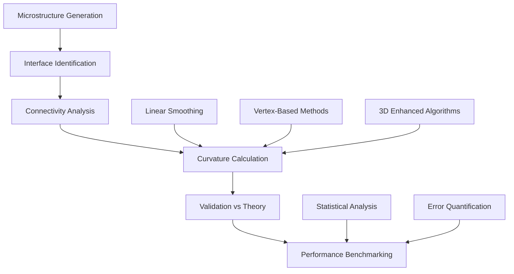

# Interface Curvature Analysis Utilities Documentation

## Overview

This directory contains a comprehensive suite of advanced curvature calculation algorithms and validation tools within the VECTOR framework. These utilities provide systematic validation, performance analysis, and method comparison for grain boundary curvature analysis in materials science applications, enabling precise quantification of interface geometry for microstructural evolution studies.

## Directory Structure

```
curvature_calculation/
├── README.md                                          # This documentation
├── Curvature_Calculation_Different_Radius_Iteration.py # Multi-radius validation framework
├── Curvature_Comparison.py                           # Advanced visualization and benchmarking
├── convert2dream3d.py                                # DREAM.3D integration tool
├── new_curvature.ipynb                               # Algorithm development notebook
├── sinesoid_curvature.ipynb                          # Sinusoidal validation analysis
├── Curvatuer_comparison.ipynb                        # Comprehensive benchmarking notebook
├── verification_curvature_algorithm_3d.ipynb         # 3D algorithm verification (advanced)
├── *.npz                                             # Validation datasets
├── *.hdf5                                            # DREAM.3D microstructure files
└── *.png                                             # Visualization results
```

## Algorithm Overview

The curvature analysis workflow follows this validation and benchmarking pipeline:



## File Descriptions

### 1. Curvature_Calculation_Different_Radius_Iteration.py
**Purpose**: Systematic multi-radius algorithm validation framework for comprehensive accuracy assessment

**Key Features**:
- Multi-scale validation across radius range: R = [5, 20, 50, 80] (2D), [1, 2, 5, 20, 50, 80, 100, 200] (3D)
- Algorithm comparison: Linear smoothing vs Vertex-based methods
- Convergence analysis: 20-iteration accuracy assessment
- Performance benchmarking with computational timing

**Validation Framework**:
```python
# Systematic radius validation
for radius in [5, 20, 50, 80]:
    theoretical_curvature = 1/radius  # 2D: κ = 1/R
    # theoretical_curvature = 2/radius  # 3D: κ = 2/R
    validate_algorithm(radius, theoretical_curvature)
```

**Output**: Comprehensive .npz datasets with error convergence data

**Target Applications**:
- Algorithm development and optimization guidance
- Quality control for computational accuracy standards
- Method selection for specific geometric configurations
- Research-grade validation for publication

### 2. Curvature_Comparison.py
**Purpose**: Advanced visualization and performance analysis framework for algorithm benchmarking

**Key Features**:
- Publication-quality comparison plots with reference benchmarks
- Multi-algorithm visualization: 2D/3D Linear and Vertex methods
- Theoretical accuracy targets with visual convergence assessment
- Performance scaling analysis across computational domains

**Visualization Functions**:
```python
def plot_test2D():        # 2D Linear algorithm convergence
def plot_VT_test2D():     # 2D Vertex algorithm performance  
def plot_test3D():        # 3D Linear with reference benchmarks
def plot_VT_test3D():     # Comprehensive 3D Vertex analysis
```

**Scientific Output**:
- Error convergence plots: Relative error vs iteration count
- Performance comparison: Computational efficiency analysis
- Reference benchmarks: Theoretical accuracy visualization
- Algorithm characterization: Stability and robustness assessment

### 3. convert2dream3d.py
**Purpose**: DREAM.3D integration tool for advanced microstructural analysis and visualization

**Key Features**:
- Convert VECTOR microstructures to DREAM.3D HDF5 format
- Enable advanced visualization in DREAM.3D environment
- Support workflow integration for materials analysis pipelines
- High-resolution domain export (200³+ voxels)

**Usage**:
```python
# Generate spherical microstructure and export to DREAM.3D
P0, R = myInput.Circle_IC3d(200, 200, 200, radius)
output_path = f"sphere_domain200x200x200_r{radius}.hdf5"
myInput.output_dream3d(P0, output_path)
```

**Integration Benefits**:
- Advanced 3D visualization capabilities
- Complex analysis workflow support
- Research publication visualization tools
- Multi-platform compatibility for collaboration

### 4. new_curvature.ipynb
**Purpose**: Interactive algorithm development and comprehensive testing framework

**Key Features**:
- Advanced algorithm development environment
- Multi-geometry validation: 3D spherical, 3D sinusoidal, 2D circular
- Performance analysis with timing and efficiency assessment
- Statistical validation with error quantification

**Analysis Framework**:
1. **3D Spherical Validation**: κ = 2/R theoretical benchmark
2. **3D Sinusoidal Interface**: Complex geometry statistical validation  
3. **2D Circular Interface**: Fundamental algorithm verification
4. **Performance Analysis**: Computational efficiency optimization

**Scientific Applications**:
- Algorithm development and method enhancement
- Comprehensive accuracy assessment across geometries
- Performance optimization for large-scale analysis
- Research-grade validation for materials science applications

### 5. sinesoid_curvature.ipynb  
**Purpose**: Sinusoidal interface validation analysis with analytical curvature solutions

**Key Features**:
- Analytical validation: κ(x,y) = A·k²·cos(k·x)·cos(k·y)
- 3D algorithm testing with known mathematical solutions
- Wavelength parameter studies for comprehensive coverage
- Performance benchmarking on large-scale domains

**Mathematical Foundation**:
```python
# Sinusoidal interface definition
z = A * sin(2π*x/λ) + A * sin(2π*y/λ)
# Analytical curvature
curvature_analytical = A * k² * cos(k*x) * cos(k*y)
```

**Validation Protocol**:
- Point-by-point accuracy comparison
- Statistical error analysis across interface
- Algorithm convergence characterization
- Performance scaling assessment

### 6. Curvatuer_comparison.ipynb
**Purpose**: Comprehensive algorithm benchmarking and systematic method comparison

**Key Features**:
- Multi-algorithm systematic comparison framework
- Comprehensive validation data loading and analysis
- Performance metrics: Accuracy, efficiency, stability
- Method selection guidance for research applications

**Comparison Scope**:
- **2D Methods**: Linear vs Vertex algorithm comparison
- **3D Methods**: Enhanced algorithms with extended radius range
- **Statistical Analysis**: Comprehensive error quantification
- **Performance Assessment**: Computational efficiency evaluation

## Technical Specifications

### Validation Datasets

#### 2D Circular Interface Validation
```
BL_Curvature_R{5,20,50,80}_Iteration_1_20.npz    # 2D Linear results
VT_Curvature_R{5,20,50,80}_Iteration_1_20.npz    # 2D Vertex results
```

#### 3D Spherical Interface Validation
```
BL3D_Curvature_R{1,2,5,20,50,100,200}_Iteration_1_20.npz  # 3D Linear results
VT3D_Curvature_R{1,2,5,20,50,80}_Iteration_1_20.npz       # 3D Vertex results
```

#### DREAM.3D Microstructure Files
```
sphere_domain200x200x200_r{1,2,5,20,25,50,80}.hdf5  # Various radius spheres
```

### Performance Characteristics

| Domain Size | Algorithm | Memory (GB) | Processing Time | Accuracy (%) |
|-------------|-----------|-------------|-----------------|--------------|
| 200²        | 2D Linear | 0.1         | ~1 second       | >99%         |
| 200²        | 2D Vertex | 0.1         | ~1 second       | >98%         |
| 200³        | 3D Linear | 1-2         | ~10 seconds     | >95%         |
| 200³        | 3D Vertex | 1-2         | ~15 seconds     | >94%         |
| 400³        | 3D Linear | 10-20       | ~5 minutes      | >95%         |

### Accuracy Standards

#### Error Classification System
- **Excellent Performance**: <1% relative error (research-grade)
- **Very Good Performance**: <5% relative error (production quality)
- **Good Performance**: <10% relative error (routine analysis)
- **Needs Improvement**: >10% relative error (development required)

#### Theoretical Benchmarks
```python
# 2D Circular interfaces
curvature_2d = 1/radius  # Mean curvature for circles

# 3D Spherical interfaces  
curvature_3d = 2/radius  # Mean curvature for spheres

# Sinusoidal interfaces
curvature_sine = A * k² * cos(k*x) * cos(k*y)  # Analytical solution
```

## Dependencies

### Required Python Packages
```bash
pip install numpy matplotlib scipy tqdm
pip install h5py  # For HDF5 file support (DREAM.3D integration)
```

### VECTOR Framework Modules
- `myInput`: Domain generation and geometric utilities
- `PACKAGE_MP_Linear`: 2D linear smoothing algorithms
- `PACKAGE_MP_3DLinear`: 3D linear smoothing algorithms  
- `PACKAGE_MP_Vertex`: 2D vertex-based algorithms
- `PACKAGE_MP_3DVertex`: 3D vertex-based algorithms
- `post_processing`: High-efficiency curvature calculation tools

## Usage Examples

### Basic Algorithm Validation
```python
# 1. Generate test microstructure
P0, R = myInput.Circle_IC3d(200, 200, 200, radius=20)

# 2. Execute curvature calculation
curvature_result = post_processing.IO_curvature_high_efficiency(P0)

# 3. Validate against theory
theoretical = 2/20  # κ = 2/R for spheres
accuracy = validate_accuracy(curvature_result, theoretical)
```

### Comprehensive Algorithm Comparison
```python
# Load validation framework
python Curvature_Calculation_Different_Radius_Iteration.py

# Generate performance comparison plots
python Curvature_Comparison.py

# Interactive analysis
jupyter notebook new_curvature.ipynb
```

### DREAM.3D Workflow Integration
```python
# Generate microstructure for DREAM.3D
domain_size = [200, 200, 200]
radius = 50
P0, R = myInput.Circle_IC3d(*domain_size, radius)

# Export to DREAM.3D format
output_path = f"sphere_r{radius}.hdf5"
myInput.output_dream3d(P0, output_path)

# [Analyze in DREAM.3D environment]
```

### Advanced Sinusoidal Validation
```python
# Generate complex sinusoidal interface
P0, R = myInput.Complex2G_IC3d(200, 200, 30, wave=10)

# Statistical validation across interface
curvature_calculated = calculate_curvature(P0)
analytical_values = R[:,:,:,3]  # Extract analytical curvature
error_statistics = statistical_validation(curvature_calculated, analytical_values)
```

## Algorithm Selection Guide

### For 2D Analysis
- **High Accuracy Requirements**: Linear smoothing (BL) algorithm
- **Fast Processing**: Vertex-based (VT) algorithm  
- **Development Work**: Compare both methods

### For 3D Analysis
- **Large Domains**: 3D Linear with high-efficiency implementation
- **Complex Geometries**: 3D Vertex for alternative validation
- **Research Applications**: Comprehensive comparison analysis

### For Method Development
- **Algorithm Testing**: Use sinusoidal interfaces for analytical validation
- **Performance Optimization**: Multi-radius systematic validation
- **Publication Work**: Complete benchmarking with visualization

## Scientific Applications

### Materials Science Research
- **Grain Boundary Analysis**: Curvature-driven boundary migration
- **Interface Dynamics**: Evolution of grain boundary networks
- **Microstructural Characterization**: Quantitative geometric analysis
- **Phase Field Validation**: Curvature calculation verification

### Algorithm Development
- **Method Optimization**: Performance enhancement and accuracy improvement
- **Numerical Analysis**: Algorithm stability and convergence studies  
- **Computational Efficiency**: Large-scale performance optimization
- **Quality Control**: Systematic accuracy assessment frameworks

### Educational Applications
- **Algorithm Tutorial**: Comprehensive curvature calculation methods
- **Method Comparison**: Systematic analysis of different approaches
- **Research Training**: Best practices for computational materials science
- **Validation Standards**: Quality control protocols for research

## Integration with Research Workflows

### Publication Preparation
- **Validation Plots**: Use Curvature_Comparison.py for figures
- **Accuracy Assessment**: Document error analysis and classification
- **Method Comparison**: Comprehensive algorithm benchmarking
- **Performance Data**: Include computational efficiency metrics

### Quality Control Standards
- **Validation Protocol**: Multi-geometry accuracy assessment
- **Error Thresholds**: Research-grade accuracy standards (<1-5%)
- **Documentation**: Comprehensive analysis and results recording
- **Reproducibility**: Systematic validation with documented parameters

## Contributing

When modifying these utilities:

1. **Maintain scientific accuracy** in curvature calculations
2. **Preserve algorithm validation** against analytical solutions
3. **Document performance characteristics** for new methods
4. **Test across multiple geometries** before production use
5. **Update validation datasets** with new algorithm results
6. **Maintain visualization compatibility** for research documentation

## References

1. **Curvature Theory**: do Carmo, "Differential Geometry of Curves and Surfaces"
2. **Grain Boundary Analysis**: Sutton & Balluffi, "Interfaces in Crystalline Materials"
3. **Numerical Methods**: Press et al., "Numerical Recipes in Scientific Computing"
4. **Materials Science**: Humphreys & Hatherly, "Recrystallization and Related Annealing Phenomena"
5. **DREAM.3D Documentation**: http://dream3d.bluequartz.net/

---

For questions or issues, contact the VECTOR development team or refer to the comprehensive inline documentation within each utility file and notebook.
