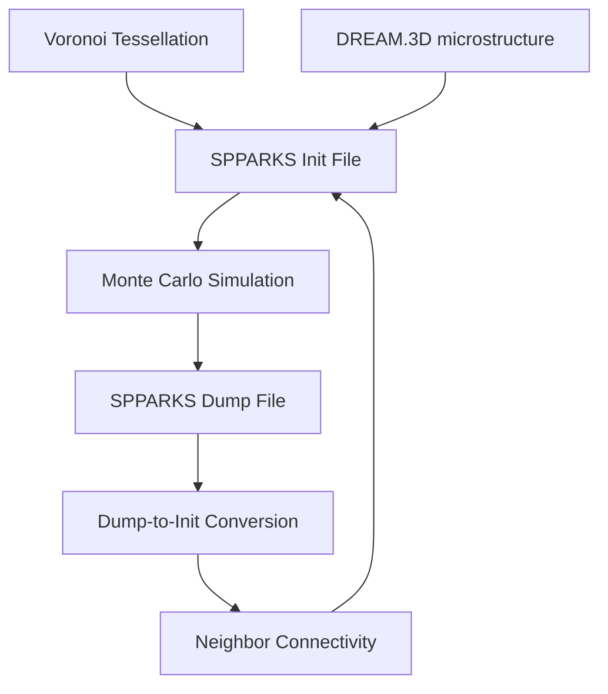

# SPPARKS Preprocessing Utilities Documentation

## Overview

This directory contains a comprehensive suite of preprocessing utilities for the SPPARKS (Stochastic Parallel PARticle Kinetic Simulator) Monte Carlo grain growth simulation framework. These tools bridge the gap between microstructure generation, simulation data processing, and anisotropic grain boundary energy calculations within the VECTOR framework.

## Directory Structure

```
dump_to_init/
├── README.md                                    # This documentation
├── dump_to_init_for_aniso_model_SPPARKS.py     # Production conversion script
├── dump_to_init_for_aniso_model_SPPARKS.ipynb  # Interactive conversion notebook
├── Voronoi2Spparks_torch.py                    # GPU-accelerated microstructure generator
├── init_neighbor_for_aniso_model_SPPARKS.py    # Large-scale neighbor file processor
└── update_init_data.ipynb                      # Microstructure modification toolkit
```

## Workflow Overview

The SPPARKS preprocessing workflow follows this general pipeline:



## File Descriptions

### 1. Voronoi2Spparks_torch.py (code from Joseph)
**Purpose**: GPU-accelerated generation of realistic polycrystalline microstructures

**Key Features**:
- PyTorch GPU acceleration for large domains (up to 1000³ sites)
- Periodic boundary conditions for realistic grain structure
- Memory-efficient batch processing
- Automatic Euler angle assignment for anisotropy

**Usage**:
```python
# Generate 3D Voronoi microstructure
ic, ea, centers = voronoi2image([450, 450, 450], 20000, 100e9)
image2init(ic, ea, "microstructure.init")
```

**Target Applications**:
- Large-scale 3D grain growth simulations
- Statistical microstructure studies
- Initial condition generation for anisotropic models

### 2. dump_to_init_for_aniso_model_SPPARKS.py/.ipynb
**Purpose**: Convert SPPARKS simulation dumps back to initialization format

**Key Features**:
- Preserve crystallographic orientations during evolution
- Extract final grain structures from simulation timesteps
- Generate neighbor connectivity for continued simulation
- Support for 2D/3D periodic domains

**Workflow**:
1. Load original Euler angle assignments
2. Extract evolved microstructure from dump file
3. Map orientations to evolved grain structure
4. Generate neighbor connectivity for anisotropic physics

**Usage**:
```python
# Convert dump file with orientation preservation
euler_angles = post_processing.init2EAarray("original.init", grain_num)
box_size, _ = post_processing.output_init_from_dump(
    "simulation.dump.16", euler_angles, "evolved.init"
)
```

### 3. init_neighbor_for_aniso_model_SPPARKS.py
**Purpose**: Specialized neighbor file generation for extremely large domains

**Key Features**:
- Optimized for billion+ site domains (1000³)
- Memory-efficient multiprocessing
- HPC cluster file system optimization
- Robust error handling for production environments

**Target Scale**:
- Domains: 1000×1000×1000 sites (1 billion total)
- Grains: 20,000+ polycrystalline structures
- Output: 100+ GB neighbor connectivity files

### 4. update_init_data.ipynb
**Purpose**: Interactive microstructure modification for controlled studies

**Key Features**:
- Create bimodal grain size distributions
- Strategic large grain placement
- Statistical grain size analysis
- Preserve realistic grain boundary topology

**Applications**:
- Abnormal grain growth studies
- Bimodal microstructure property investigations
- Controlled initial condition generation

## Technical Specifications

### File Formats

#### SPPARKS Initialization File (.init)
```
# This line is ignored
Values

site_id grain_id phi1 Phi phi2
1 1 0.123 0.456 0.789
2 1 0.123 0.456 0.789
...
```

#### SPPARKS Neighbor File (.init with neighbors)
```
# This line is ignored
3 dimension
1330 max neighbors
1000000000 sites
0 1000 xlo xhi
0 1000 ylo yhi
0 1000 zlo zhi

Sites

site_id x_coord y_coord z_coord
...

Neighbors

site_id neighbor1 neighbor2 ... neighborN
...

Values

site_id grain_id phi1 Phi phi2
...
```

### Performance Characteristics

| Domain Size | Grains | Memory (GB) | Processing Time | Output Size |
|-------------|--------|-------------|-----------------|-------------|
| 256³        | 5,000  | 1-2         | ~10 minutes     | ~500 MB     |
| 450³        | 20,000 | 10-20       | ~1 hour         | ~5 GB       |
| 1000³       | 50,000 | 100+        | ~10 hours       | ~100 GB     |

## Dependencies

### Required Python Packages
```bash
pip install numpy matplotlib tqdm multiprocess
pip install torch  # For GPU acceleration (Voronoi generation)
```

### VECTOR Framework Modules
- `myInput`: Input parameter management
- `post_processing`: Core microstructure processing functions
- `PACKAGE_MP_3DLinear`: 3D linear algebra operations

## Usage Examples

### Basic Workflow: Voronoi → Simulation → Analysis
```python
# 1. Generate initial microstructure
ic, ea, _ = voronoi2image([450, 450, 450], 20000, 100e9)
image2init(ic, ea, "initial.init")

# 2. [Run SPPARKS simulation externally]

# 3. Convert evolved dump back to init format
euler_angles = post_processing.init2EAarray("initial.init", 20000)
box_size, _ = post_processing.output_init_from_dump(
    "simulation.dump.final", euler_angles, "evolved.init"
)

# 4. Generate neighbor connectivity for continued analysis
post_processing.output_init_neighbor_from_init_mp(
    5, box_size, "evolved.init", "evolved_neighbors.init"
)
```

### Bimodal Microstructure Generation
```python
# Load existing microstructure
init_img = post_processing.init2img(box_size, "uniform.init")

# Create large grain regions (see update_init_data.ipynb for details)
# [Grain merging algorithm]

# Output modified microstructure
post_processing.image2init(modified_img, euler_angles, "bimodal.init")
```

## Integration with SPPARKS

### Energy Matrix Configuration
The utilities preserve Euler angles for anisotropic calculations:
- **Cosine Energy Function**: Standard GB energy based on misorientation
- **Well Energy Function**: Enhanced anisotropy with `_ab` suffix notation
- **5D Orientation Space**: Full crystallographic parameter space

## Scientific Applications

### Grain Growth Studies
- **Normal grain growth**: Uniform energy, statistical evolution
- **Abnormal grain growth**: Bimodal distributions, texture effects
- **Anisotropic evolution**: Orientation-dependent boundary mobility

### Microstructure-Property Relationships
- **Statistical grain size effects**: Large domain averaging
- **Bimodal property investigations**: Controlled size distributions
- **Topology evolution**: Grain boundary network changes

### Model Validation
- **Algorithm verification**: Curvature-driven growth laws
- **Energy model testing**: Anisotropic vs isotropic comparison
- **Scale effects**: Domain size sensitivity studies

## References

1. **SPPARKS Documentation**: https://spparks.sandia.gov/
2. **VECTOR Framework**: Internal grain boundary analysis tools
3. **Grain Growth Theory**: Humphreys & Hatherly, "Recrystallization and Related Annealing Phenomena"
4. **Monte Carlo Methods**: Landau & Binder, "A Guide to Monte Carlo Simulations in Statistical Physics"

---

For questions or issues, contact the VECTOR development team or refer to the comprehensive inline documentation within each utility file.
