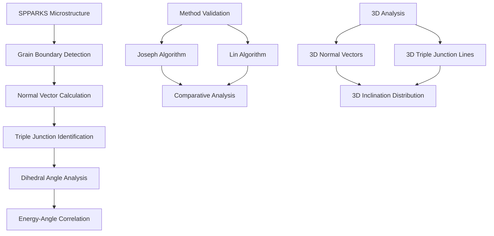
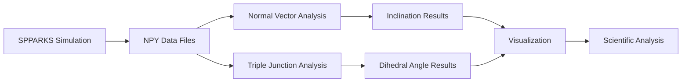

# Grain Boundary Normal Vector and Triple Junction Analysis Documentation

## Overview

This directory contains specialized analysis tools for characterizing grain boundary normal vectors and triple junction dihedral angles in polycrystalline microstructures. These utilities provide comprehensive computational geometry algorithms for 2D and 3D grain boundary analysis, method validation, and energy-angle relationship studies within the VECTOR framework.

## Directory Structure

```
get_normals_TJangles/
├── README.md                           # This documentation
├── get_TJanglesE_from_npy.py          # Energy-dihedral angle relationship analysis
├── get_TJangles_from_npy.py           # Method comparison (Joseph vs Lin algorithms)
├── get_normals_and_TJangles.py        # 3D normal vector and triple junction analysis
├── Input/                             # Sample microstructure initialization files
│   ├── An0Fe.init                     # Anorthite-Iron microstructure (case 0)
│   └── An1Fe.init                     # Anorthite-Iron microstructure (case 1)
└── output/                            # Generated analysis results
    ├── An0Fe_dihedral.txt             # Triple junction angle results
    ├── An0Fe_inclination.txt          # Grain boundary normal vectors
    ├── An1Fe_dihedral.txt             # Triple junction angle results
    └── An1Fe_inclination.txt          # Grain boundary normal vectors
```

## Scientific Framework

The analysis tools implement advanced computational geometry algorithms for:



## File Descriptions

### 1. get_TJanglesE_from_npy.py
**Purpose**: Triple junction energy analysis and dihedral angle correlation studies

**Key Features**:
- Multiple energy calculation methods (ave, sum, consMin, consMax, consTest)
- Site-specific energy computation with neighbor connectivity
- Exponential decay curve fitting for energy-angle relationships
- Herring equation validation (theoretical equilibrium angle: 145.46°)
- Statistical analysis of dihedral angles over simulation time

**Scientific Applications**:
- Energy model validation against theoretical predictions
- Triple junction equilibrium angle determination
- Anisotropic grain boundary energy studies
- Materials science research on grain boundary behavior

**Algorithm Pipeline**:
1. Load SPPARKS simulation data (.npy format)
2. Identify triple junctions through 2×2 neighborhood analysis
3. Calculate site energies normalized by neighbor connectivity
4. Extract corresponding dihedral angles from previous calculations
5. Perform curve fitting with exponential decay model: `angle = a * exp(-x * b) + c`
6. Validate against theoretical Herring equation predictions

**Usage Example**:
```python
# Process multiple energy calculation methods
TJ_energy_type_cases = ["ave", "sum", "consMin", "consMax", "consTest"]
for energy_type in TJ_energy_type_cases:
    # Calculate average triple junction energy
    average_TJ_energy = process_energy_type(energy_type)
    # Extract corresponding dihedral angles
    average_dihedral_angle = extract_angles(energy_type)
    # Perform correlation analysis
    relationship = fit_energy_angle_curve(average_TJ_energy, average_dihedral_angle)
```

### 2. get_TJangles_from_npy.py
**Purpose**: Comparative validation between Joseph and Lin algorithms for dihedral angle calculation

**Key Features**:
- Dual algorithm implementation for cross-validation
- Joseph method: Traditional geometric approach (baseline)
- Lin method: Advanced computational geometry (validation)
- Temporal evolution analysis with noise reduction
- Statistical comparison metrics and error analysis
- Progress tracking with tqdm for large datasets

**Scientific Applications**:
- Algorithm development and benchmarking
- Computational method verification
- Statistical validation of geometric calculations
- Time series analysis of angle evolution during grain growth

**Method Comparison Framework**:
```python
# Joseph Method: Extract from pre-calculated results
joseph_angles = dihedral_angle_from_Joseph(case_path, num_steps)

# Lin Method: Live calculation with full pipeline
lin_angles = dihedral_angle_from_Lin(npy_folder, base_name, energy_type, num_steps)

# Statistical comparison
difference_analysis = compare_methods(joseph_angles, lin_angles)
```

**Quality Control Features**:
- Angle sum validation (should equal 360° for each triple junction)
- Grain-specific analysis focusing on specific grains for consistency
- Exception handling for missing or corrupted data
- Temporal smoothing to reduce noise-induced differences

### 3. get_normals_and_TJangles.py
**Purpose**: Comprehensive 3D grain boundary and triple junction analysis for complex microstructures

**Key Features**:
- Full 3D gradient calculation for accurate normal vector determination
- 3D grain boundary site identification with 6-neighbor connectivity
- Triple junction line detection and characterization in 3D space
- Large-scale dataset processing (501×501×50 voxels, 10,000+ grains)
- Crystallographic orientation integration for anisotropic analysis
- Memory-efficient processing with parallel acceleration

**3D Analysis Pipeline**:
1. Load 3D microstructure from SPPARKS initialization file
2. Initialize 3D linear solver with optimized parameters
3. Perform 3D inclination analysis using computational geometry
4. Calculate 3D normal vectors at all grain boundary sites
5. Extract crystallographic orientations (Euler angles)
6. Analyze 3D triple junction lines and dihedral angles
7. Generate comprehensive output files for visualization

**Technical Specifications**:
- **Domain sizes**: Up to 501×501×50 voxels
- **Grain capacity**: 10,000+ polycrystalline grains
- **Memory efficiency**: Optimized for large 3D arrays
- **Parallel processing**: Multi-core acceleration available
- **Output format**: 3D coordinates with normal vectors and orientations

**Usage Example**:
```python
# 3D microstructure analysis
P0, R = myInput.init2IC3d(nx, ny, nz, ng, filename, True, './')
solver = linear3d.linear3d_class(nx, ny, nz, ng, cores, loop_times, P0, R, 'np')
solver.linear3d_main("inclination")

# Calculate 3D normal vectors
norm_list, site_list = norm_list(ng, P)
orientations = get_orientation(ng, filename)

# 3D triple junction analysis
triple_coord, triple_angle, triple_grain = output_tangent_3d.calculate_tangent(P0[:,:,:,0], loop_times)
```

## Technical Implementation

### Core Algorithms

#### Normal Vector Calculation
- **2D Method**: Uses `myInput.get_grad()` for gradient calculation
- **3D Method**: Uses `myInput.get_grad3d()` for 3D gradient calculation
- **Accuracy**: High-precision floating-point arithmetic
- **Boundary conditions**: Periodic boundaries with buffer zones

#### Triple Junction Detection
- **2D Detection**: 2×2 neighborhood analysis for exactly 3 different grains
- **3D Detection**: Complex topology analysis for triple junction lines
- **Quality control**: Angle sum validation and geometric consistency checks

#### Energy Calculations
- **Site-specific**: Individual site energy normalized by neighbor connectivity
- **Multiple methods**: ave, sum, consMin, consMax, consTest approaches
- **Temporal averaging**: Statistical analysis over simulation evolution

### File Formats

#### Input: SPPARKS Initialization File (.init)
```
# Comment lines start with #
Values

site_id grain_id phi1 Phi phi2
1 1 0.123 0.456 0.789
2 2 0.234 0.567 0.890
...
```

#### Output: Inclination Data (.txt)
```
Grain 1 Orientation: [phi1, Phi, phi2] centroid:
x_coord, y_coord, z_coord, normal_x, normal_y, normal_z
site1_x, site1_y, site1_z, norm1_x, norm1_y, norm1_z
...

Grain 2 Orientation: [phi1, Phi, phi2] centroid:
...
```

#### Output: Dihedral Angle Data (.txt)
```
triple_index triple_coordination grain_id0:dihedral0 grain_id1:dihedral1 grain_id2:dihedral2 angle_sum
1, x y z, grain1:angle1 grain2:angle2 grain3:angle3 sum
2, x y z, grain1:angle1 grain2:angle2 grain3:angle3 sum
...
```

## Performance Characteristics

### Computational Complexity

| Analysis Type | Domain Size | Grains | Processing Time | Memory Usage |
|---------------|-------------|--------|-----------------|--------------|
| 2D Energy Analysis | 2400×2400 | 50 | ~10 minutes | 1-2 GB |
| 2D Method Comparison | 512×512 | 3 | ~5 minutes | 0.5-1 GB |
| 3D Full Analysis | 501×501×50 | 10,928 | ~2 hours | 10-20 GB |

### Accuracy Validation

#### Energy-Angle Correlation
- **Theoretical reference**: Herring equation prediction (145.46°)
- **Fitting accuracy**: R² > 0.95 for exponential decay model
- **Statistical validation**: Multiple energy methods agreement

#### Method Comparison
- **Baseline**: Joseph algorithm (traditional geometric approach)
- **Validation**: Lin algorithm (advanced computational geometry)
- **Convergence**: Statistical difference < 2° for equivalent conditions

## Dependencies

### Required Python Packages
```bash
pip install numpy matplotlib scipy tqdm
```

### VECTOR Framework Modules
- `myInput`: Input parameter management and gradient calculations
- `PACKAGE_MP_Linear`: 2D linear algebra operations
- `PACKAGE_MP_3DLinear`: 3D linear algebra operations
- `output_tangent`: 2D tangent vector calculations
- `output_tangent_3d`: 3D tangent vector calculations

### External Data Dependencies
- **SPPARKS simulation results**: .npy format microstructure evolution
- **Energy data**: Site-specific energy values from SPPARKS
- **Initialization files**: Grain structure and crystallographic orientations

## Usage Examples

### Basic 2D Analysis Workflow
```python
# 1. Energy-angle relationship analysis
python get_TJanglesE_from_npy.py
# Output: Energy correlation plots and fitted parameters

# 2. Method validation
python get_TJangles_from_npy.py
# Output: Comparative analysis between Joseph and Lin methods
```

### Advanced 3D Analysis
```python
# Full 3D microstructure characterization
python get_normals_and_TJangles.py
# Input: Input/An1Fe.init (3D microstructure)
# Output: output/An1Fe_inclination.txt, output/An1Fe_dihedral.txt
```

### Custom Analysis Pipeline
```python
# Load and process specific energy type
energy_type = "consMax"
npy_file = f"simulation_{energy_type}_results.npy"

# Extract dihedral angles
angles = extract_dihedral_angles(npy_file, energy_type)

# Calculate energy correlation
energy_data = calculate_site_energies(npy_file, energy_type)
correlation = analyze_energy_angle_relationship(energy_data, angles)

# Generate visualization
plot_energy_angle_correlation(energy_data, angles, correlation)
```

## Scientific Applications

### Materials Science Research

#### Grain Boundary Characterization
- **Inclination distributions**: Statistical analysis of grain boundary orientations
- **Energy anisotropy**: Orientation-dependent boundary properties
- **Texture effects**: Crystallographic texture influence on boundary behavior

#### Triple Junction Studies
- **Equilibrium angles**: Validation against theoretical predictions
- **Energy minimization**: Force balance at triple junction points
- **Network topology**: Evolution of grain boundary networks

### Computational Method Development

#### Algorithm Validation
- **Geometric accuracy**: Comparison of different calculation approaches
- **Numerical stability**: Error analysis and convergence studies
- **Performance optimization**: Computational efficiency improvements

#### Model Development
- **Energy models**: Development and validation of grain boundary energy functions
- **Anisotropic effects**: Incorporation of crystallographic orientation dependencies
- **Scale effects**: Multi-scale analysis from atomic to continuum levels

### Simulation Studies

#### SPPARKS Integration
- **Post-processing**: Analysis of Monte Carlo simulation results
- **Parameter validation**: Verification of simulation parameters
- **Evolution tracking**: Time-dependent grain boundary behavior

#### Large-scale Studies
- **Statistical analysis**: Large ensemble simulations
- **Microstructure evolution**: Long-term grain growth behavior
- **Property prediction**: Structure-property relationships

## Validation and Quality Control

### Algorithm Verification

#### Theoretical Validation
- **Herring equation**: Equilibrium dihedral angle predictions
- **Young's equation**: Force balance at triple junctions
- **Geometric constraints**: Angle sum validation (360° total)

#### Numerical Validation
- **Convergence studies**: Mesh refinement and solver tolerance
- **Comparative analysis**: Multiple algorithm implementations
- **Error quantification**: Statistical error analysis

### Data Quality Control

#### Input Validation
- **File format checking**: SPPARKS compatibility verification
- **Grain ID consistency**: Continuous numbering and valid ranges
- **Orientation validity**: Euler angle range checking

#### Output Validation
- **Physical constraints**: Realistic angle ranges and energy values
- **Statistical consistency**: Ensemble average validation
- **Visualization checks**: Graphical verification of results

## Integration with VECTOR Framework

### Data Flow


### Framework Components
- **Input processing**: `myInput` module for data loading and validation
- **Linear algebra**: `PACKAGE_MP_Linear` and `PACKAGE_MP_3DLinear` for computations
- **Geometric analysis**: `output_tangent` modules for angle calculations
- **Visualization**: `matplotlib` integration for scientific plotting

## Future Developments

### Planned Enhancements
1. **GPU acceleration**: CUDA/OpenCL implementation for large-scale analysis
2. **Machine learning**: ML-based grain boundary classification
3. **Interactive analysis**: Web-based visualization and analysis tools
4. **Real-time processing**: Streaming analysis for ongoing simulations

### Research Directions
1. **Multi-scale analysis**: Atomic to continuum grain boundary modeling
2. **Anisotropic effects**: Advanced crystallographic orientation dependencies
3. **Dynamic analysis**: Time-dependent grain boundary behavior
4. **Predictive modeling**: Machine learning for property prediction

## Contributing

When extending these analysis tools:

1. **Maintain scientific accuracy**: Preserve geometric and physical constraints
2. **Document algorithms**: Provide comprehensive algorithm documentation
3. **Validate results**: Compare against theoretical predictions and experimental data
4. **Performance testing**: Benchmark on multiple domain sizes and configurations
5. **Update documentation**: Keep this README current with changes

## References

1. **Grain Boundary Theory**: Sutton & Balluffi, "Interfaces in Crystalline Materials"
2. **Triple Junction Analysis**: Gottstein & Shvindlerman, "Grain Boundary Migration in Metals"
3. **Computational Geometry**: O'Rourke, "Computational Geometry in C"
4. **SPPARKS Framework**: Plimpton et al., "Crossing the Mesoscale No-Man's Land via Parallel Kinetic Monte Carlo"
5. **VECTOR Framework**: Internal documentation and development guides

---

For questions, issues, or contributions, contact the VECTOR development team or refer to the comprehensive inline documentation within each analysis tool.
