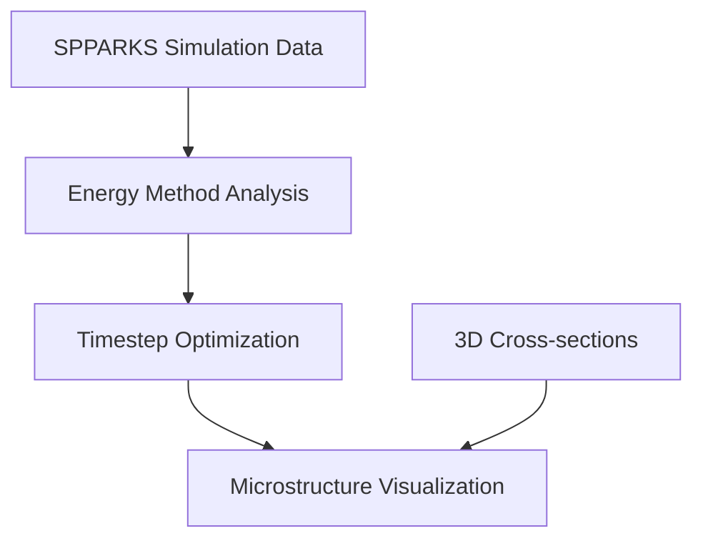

# Microstructure Visualization and Analysis Documentation

## Overview

This directory contains a comprehensive suite of advanced microstructure visualization and analysis tools for the VECTOR framework. These utilities provide sophisticated capabilities for analyzing grain growth evolution, energy method validation, and large-scale polycrystalline system characterization using various energy calculation approaches and visualization techniques.

## Directory Structure

```
microstructure/
├── README.md                                           # This documentation
├── figures/                                           # Generated visualization outputs
├── plot_microstructure_for_poly20k_hipergator.py      # Large-scale oriented grain analysis
├── plot_microstructure_for_poly20k_randomtheta0_hipergator.py  # Random orientation analysis
├── plot_microstructure_for_circle.py                  # Circular geometry parameter studies
├── plot_microstructure_for_hex.py                     # Hexagonal TJE validation
├── plot_microstructure_for_poly.py                    # Medium-scale delta parameter studies
├── plot_microstructure_for_circle.ipynb               # Interactive circular inclination studies
├── plot_3Dmicrostructure_for_264D5k.ipynb            # Advanced 3D visualization
└── plot_microstructure_for_poly20k_inclination.ipynb  # Large-scale inclination energy analysis
```

## Workflow Overview

The microstructure analysis workflow follows this general pipeline:



## File Descriptions

### Python Scripts

#### 1. plot_microstructure_for_poly20k_hipergator.py
**Purpose**: Large-scale oriented polycrystalline microstructure visualization

**Key Features**:
- 20,000 initial grains with crystallographic orientations
- HiPerGator 64-core parallel processing optimization
- Multiple energy method comparison (ave, min, max, consMin, consMax)
- Post-processing integration for advanced analysis
- Target-based timestep selection (2000-grain convergence)

**Scientific Applications**:
- Anisotropic grain growth simulation analysis
- Energy method validation in oriented systems
- Large-scale parallel simulation documentation
- Crystallographic texture effect studies

#### 2. plot_microstructure_for_poly20k_randomtheta0_hipergator.py
**Purpose**: Random orientation initialization with energy method comparison

**Key Features**:
- Random theta0 initialization for statistical studies
- Six energy calculation methods (qs1-qs6)
- Consistent visualization parameters across methods
- Batch processing for multiple timesteps
- High-resolution PNG output (400 DPI)

**Target Applications**:
- Statistical grain growth analysis
- Energy method benchmarking
- Random vs. oriented system comparison
- Computational method validation

#### 3. plot_microstructure_for_circle.py
**Purpose**: Circular geometry parameter sensitivity studies

**Key Features**:
- Two-grain circular systems for controlled studies
- Systematic delta parameter variation (0.0 to 0.95)
- Crystallographic orientation studies
- Mobility parameter analysis (m=2,4,6)
- High-contrast grayscale visualization

**Research Focus**:
- Parameter sensitivity analysis for inclination energy methods
- Algorithm validation in simplified geometries
- Crystallographic orientation effect quantification
- Mobility parameter optimization studies

#### 4. plot_microstructure_for_hex.py
**Purpose**: Hexagonal microstructure triple junction energy validation

**Key Features**:
- 48-grain regular hexagonal arrangement
- Triple junction energy (TJE) method validation
- Angle-dependent energy calculations
- Initial state analysis for energy method verification
- 32-core parallel processing optimization

**Validation Objectives**:
- Triple junction energy method validation
- Systematic verification of energy calculation algorithms
- Controlled grain boundary evolution studies
- Algorithm benchmarking with known geometric constraints

#### 5. plot_microstructure_for_poly.py
**Purpose**: Medium-scale polycrystalline delta parameter studies

**Key Features**:
- 512 initial grains for intermediate-scale analysis
- Delta parameter sweep (0.0 to 0.95)
- Target-based evolution (~10 final grains)
- Rainbow colormap for grain distinction
- Multi-core processing optimization (8-16 cores)

**Analysis Focus**:
- Anisotropy parameter effect quantification
- Grain growth kinetics analysis
- Computational efficiency studies
- Medium-scale microstructure evolution documentation

### Jupyter Notebooks

#### 1. plot_microstructure_for_circle.ipynb
**Purpose**: Interactive circular microstructure inclination energy analysis

**Key Features**:
- CosMax1Mobility inclination energy formulation
- Two-grain circular system validation
- High-contrast visualization for boundary definition
- Timestep-optimized analysis (2100 time units)
- Interactive parameter exploration

**Research Applications**:
- Inclination energy method validation in simplified geometries
- Algorithm verification for orientation-dependent calculations
- Two-grain system boundary evolution documentation

#### 2. plot_3Dmicrostructure_for_264D5k.ipynb
**Purpose**: Advanced 3D microstructure visualization and analysis

**Key Features**:
- Large-scale 3D systems (264³ domain, 5000 grains)
- Cross-sectional analysis across all three dimensions
- 3D contour surface projections
- Energy method comparison (isotropic vs. anisotropic)
- HiPerGator 64-core optimization

**Visualization Capabilities**:
- Multi-dimensional slicing (X, Y, Z directions)
- 3D contour plots with surface projections
- Time-series animation capabilities
- Comparative energy method analysis

#### 3. plot_microstructure_for_poly20k_inclination.ipynb
**Purpose**: Large-scale inclination energy method analysis

**Key Features**:
- 20,000-grain systems for realistic polycrystalline behavior
- Advanced inclination energy formulations
- Misorientation (M) vs. Inclination (I) dependency studies
- Adaptive grain count analysis
- Dual-target studies (1000 and 200 grains)

**Advanced Methods**:
- CosMax1Mobility: Maximum-based cosine with mobility coupling
- CosMin1: Minimum-based cosine inclination energy
- MI dependency isolation: Pure M, pure I, and combined effects
- Well energy variants for enhanced anisotropy

## Technical Specifications

### System Scales and Processing Requirements

| Script/Notebook | Initial Grains | Domain Type | Processing | Memory (GB) | Output Quality |
|------------------|----------------|-------------|------------|-------------|----------------|
| poly20k_hipergator | 20,000 | 2D Oriented | 64-core | 50-100 | 400 DPI PNG |
| poly20k_randomtheta0 | 20,000 | 2D Random | 64-core | 50-100 | 400 DPI PNG |
| circle | 2 | 2D Circular | 16-core | 1-5 | 400 DPI PNG |
| hex | 48 | 2D Hexagonal | 32-core | 5-10 | 400 DPI PNG |
| poly | 512 | 2D Medium | 8-16 core | 10-20 | 400 DPI PNG |
| 3D_264D5k | 5,000 | 3D (264³) | 64-core | 100+ | 15×20 inch |
| inclination | 20,000 | 2D Large | Cluster | 50-100 | Rainbow maps |

### Energy Method Categories

#### Traditional Energy Formulations
- **Isotropic**: Baseline delta=0.0 (no anisotropy effects)
- **Average (ave)**: Arithmetic mean of triple junction energies
- **Minimum (min)**: Pure minimum energy selection
- **Maximum (max)**: Maximum energy criterion

#### Advanced Energy Methods
- **Conservative Minimum (consMin)**: Weighted minimum energy approach
- **Conservative Maximum (consMax)**: Weighted maximum energy approach
- **Well Energy**: Traditional well energy formulation
- **Cosine Energy**: Standard cosine-based calculations

#### Inclination Energy Methods
- **CosMin1**: Minimum-based cosine inclination energy
- **CosMax1Mobility**: Maximum-based cosine with mobility coupling
- **MI Dependencies**: Systematic misorientation/inclination studies

### Visualization Specifications

#### Color Mapping Strategies
- **Rainbow**: Maximum grain distinction for large systems
- **Grayscale**: High-contrast boundary definition
- **Consistent normalization**: Initial timestep range preservation
- **Publication quality**: 400 DPI standard output

#### File Naming Conventions
```
{system_type}_{energy_method}_{parameters}_ts{timestep}.png

Examples:
s1400p_ori_ave_qs1_poly20k_667_ts20010.png
microstructure_circle_inclination_CosMax1Mobility_ts2100.png
3Dmicrostructure_264D5k_dimension0_depth132.png
```

## Usage Examples

### Basic Large-Scale Analysis
```python
# Large-scale oriented grain analysis
python plot_microstructure_for_poly20k_hipergator.py

# Generates comparative visualizations for:
# - Average, minimum, maximum energy methods
# - Initial and final state documentation
# - HiPerGator-optimized processing
```

### Parameter Sensitivity Studies
```python
# Circular geometry parameter sweep
python plot_microstructure_for_circle.py

# Systematic analysis of:
# - Delta values: 0.0, 0.2, 0.4, 0.6, 0.8, 0.95
# - Crystallographic orientations
# - Mobility parameters (m=2,4,6)
```

### Interactive Inclination Energy Analysis
```jupyter
# Open plot_microstructure_for_poly20k_inclination.ipynb
# Execute cells for:
# 1. Primary inclination energy comparison (1000-grain target)
# 2. Advanced MI dependency studies (200-grain target)
# 3. Adaptive timestep selection based on grain count
```

### 3D Visualization Workflow
```jupyter
# Open plot_3Dmicrostructure_for_264D5k.ipynb
# Generates:
# 1. Cross-sectional analysis (11 levels × 3 dimensions)
# 2. 3D contour surface projections
# 3. Time-series evolution documentation
```

## Scientific Applications

### Energy Method Development
- **Algorithm Validation**: Comprehensive testing across multiple scales
- **Performance Benchmarking**: Systematic comparison of calculation methods
- **Parameter Optimization**: Delta, mobility, and orientation studies
- **Implementation Verification**: Validation of complex energy algorithms

### Microstructure Characterization
- **Grain Growth Mechanisms**: Evolution pattern documentation
- **Anisotropic Effects**: Orientation-dependent behavior analysis
- **Scale Effects**: Domain size and grain count sensitivity
- **Topology Evolution**: Grain boundary network changes

### Computational Studies
- **HPC Optimization**: Large-scale parallel processing validation
- **Memory Efficiency**: Large dataset handling strategies
- **Visualization Standards**: Publication-quality figure generation
- **Cross-Platform Compatibility**: Cluster and workstation deployment

## Dependencies

### Required Python Packages
```bash
pip install numpy matplotlib tqdm
pip install jupyter ipykernel  # For notebook execution
```

### VECTOR Framework Modules
- `myInput`: Input parameter management
- `post_processing`: Advanced microstructure processing
- `PACKAGE_MP_Linear`: Linear algebra operations
- `PACKAGE_MP_3DLinear`: 3D analysis capabilities

### Optional GPU Acceleration
```bash
pip install torch  # For large-scale 3D processing
```

## Data Sources and Integration

### SPPARKS Simulation Data
- **File Format**: NumPy arrays (.npy) with temporal evolution
- **Data Structure**: 4D/5D arrays [time, x, y, (z), features]
- **Feature Encoding**: Grain IDs, orientations, energy values
- **Temporal Resolution**: Configurable timestep intervals

### HiPerGator Data Integration
```python
# Standard data path structure
npy_file_folder = "/blue/michael.tonks/lin.yang/SPPARKS-VirtualIncEnergy/"
subfolder_structure = {
    "2d_poly_multiCoreCompare": "Large-scale 2D studies",
    "2d_poly_wellEnergy": "Inclination energy methods",
    "2d_poly_fully": "MI dependency studies",
    "3d_poly": "3D volumetric analysis"
}
```

### Energy Method File Naming
```
{prefix}_{orientation}_{energy_method}_{parameters}.npy

Examples:
p_ori_ave_aveE_20000_multiCore64_delta0.6_m2_J1_refer_1_0_0_seed56689_kt066.npy
pm_ori_ave_qs1_poly20k_667.npy
h_ori_ave_aveE_hex_multiCore32_delta0.6_m2_J1_refer_1_0_0_seed56689_kt066_angle.npy
```

## Contributing

When extending these visualization tools:

1. **Maintain Consistency**: Use established colormap and DPI standards
2. **Document Parameters**: Add comprehensive function documentation
3. **Test Scalability**: Validate on multiple grain count scales
4. **Preserve Compatibility**: Ensure HiPerGator cluster compatibility
5. **Update Documentation**: Reflect changes in this README

## References

1. **VECTOR Framework**: Internal grain boundary analysis and energy calculation tools
2. **SPPARKS**: Stochastic Parallel PARticle Kinetic Simulator for grain growth
3. **Grain Growth Theory**: Humphreys & Hatherly, "Recrystallization and Related Annealing Phenomena"
4. **Energy Methods**: Read-Shockley, Inclination Energy, and Advanced Formulations
5. **HiPerGator**: University of Florida High-Performance Computing Center

---

For questions or issues with microstructure visualization and analysis, contact the VECTOR development team or refer to the comprehensive inline documentation within each script and notebook.
