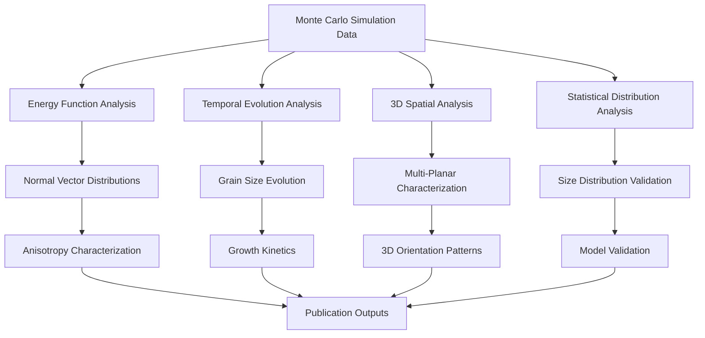

# Grain Growth Property Analysis Documentation

## Overview

This directory contains a comprehensive suite of analysis tools for characterizing grain boundary properties, microstructural evolution, and energy function effects in polycrystalline systems. These tools provide advanced visualization and quantitative analysis capabilities for Monte Carlo Potts (MCP) model simulations, phase field comparisons, and energy function validation within the VECTOR framework.

## Directory Structure

```
plot_GG_property/
├── README.md                                                    # This documentation
├── figures/                                                     # Generated visualization outputs
├── normal_distribution_data/                                    # Cached normal vector analysis data
├── NGSD_*/                                                      # Energy-specific data directories
│
├── Core Analysis Scripts
├── plot_normal_distribution_over_time_hipergator.py            # Energy function comparison analysis
├── plot_normal_distribution_over_time_hipergator_kT3D.ipynb    # 3D thermal fluctuation analysis
├── compare_grain_num.py                                        # Grain count evolution comparison
├── compare_grain_size_distribution.py                          # Size distribution validation
├── plot_average_grain_size_over_time.py                        # Temporal grain size analysis
│
├── 3D Analysis Suite
├── plot_normal_distribution_over_time_for_3D_hipergator.py     # 3D normal vector analysis
├── plot_normal_distribution_over_time_for_3D_hipergator.ipynb  # Interactive 3D analysis
├── plot_normal_distribution_over_time_for_3Dsphere_hipergator.py # 3D spherical geometry analysis
├── plot_normal_distribution_over_time_for_3D.py               # Standard 3D analysis
│
├── Specialized Analysis Tools
├── plot_normal_distribution_over_time_hipergator_kT.py         # Temperature scaling analysis
├── plot_normal_distribution_over_time_hipergator_kT.ipynb      # Interactive kT analysis
├── plot_energy_time_for_poly20k_consMin1_hipergator.ipynb     # Energy-time evolution analysis
├── plot_frequency_energy.ipynb                                # Energy frequency analysis
│
├── Geometric and Model Comparisons
├── plot_normal_distribution_over_time_for_circle.py           # Circular geometry analysis
├── plot_normal_distribution_over_time_for_poly.py             # Standard polycrystal analysis
├── plot_normal_distribution_over_time_for_poly20k_*.py        # Large-scale polycrystal studies
│
├── Interactive Notebooks
├── plot_average_grain_size_over_time_hipergator.ipynb         # Interactive size evolution
├── plot_average_grain_size_over_time_curvature_cases.ipynb    # Curvature effect analysis
├── plot_normal_distribution_over_time_for_poly20k_randomtheta0_hipergator.ipynb # Random orientation analysis
└── plot_normal_distribution_over_time_for_poly20k_wellEnergy_hipergator.ipynb   # Well energy analysis
```

## Analytical Framework Overview

The grain growth property analysis workflow encompasses multiple interconnected analytical approaches:



## Core Analysis Categories

### 1. Energy Function Comparison Analysis

#### plot_normal_distribution_over_time_hipergator.py
**Purpose**: Comprehensive grain boundary energy function comparison with bias correction

**Key Features**:
- **6 Energy Methods**: ave, consMin, sum, min, max, consMax with delta=0.6
- **Isotropic Baseline**: Reference comparison with delta=0.0
- **Bias Correction**: kT=0.66 reference methodology for enhanced statistical comparison
- **HiPerGator 64-Core**: Massive parallel processing for energy function computations
- **Normal Vector Analysis**: VECTOR Linear2D inclination analysis with energy-dependent processing

**Scientific Applications**:
- Energy averaging method sensitivity analysis for grain boundary orientation
- Comparative energy function validation through orientation distribution analysis
- Energy function optimization for realistic grain boundary energy minimization

**Output**: High-resolution polar plots comparing orientation distributions across energy methods

### 2. 3D Thermal Fluctuation Analysis

#### plot_normal_distribution_over_time_hipergator_kT3D.ipynb
**Purpose**: Extended 3D Monte Carlo temperature scaling analysis

**Key Features**:
- **Extended kT Range**: {0.00, 0.30, 0.66, 1.00, 1.30, 1.60, 1.95, 2.30, 2.60}
- **Multi-Planar Analysis**: XOY, XOZ, YOZ crystallographic plane characterization
- **450³ Grid Resolution**: Large-scale 3D statistical mechanics validation
- **Combined Anisotropy**: Magnitude averaging across three crystallographic planes
- **Post-Processing Integration**: 3D normal vector computation and anisotropy analysis

**Scientific Applications**:
- Temperature-dependent grain boundary orientation pattern analysis
- 3D anisotropy magnitude characterization across thermal regimes
- Statistical mechanics validation for 3D polycrystalline systems

**Output**: Multi-planar thermal analysis with combined anisotropy magnitude visualization

### 3. Comparative Evolution Analysis

#### compare_grain_num.py
**Purpose**: Grain number evolution validation between MCP and Phase Field methods

**Key Features**:
- **Cross-Method Validation**: Monte Carlo Potts vs. Phase Field comparison
- **Multi-Energy Analysis**: All 6 energy methods with isotropic baseline
- **Temporal Scaling**: Proper scaling parameters between simulation frameworks
- **HiPerGator Integration**: Large-scale simulation dataset processing

**Applications**:
- Model validation and verification studies
- Temporal evolution kinetics characterization
- Energy method effect quantification on grain population dynamics

#### compare_grain_size_distribution.py
**Purpose**: Statistical grain size distribution validation and comparison

**Key Features**:
- **2D vs. 3D Comparison**: Dimensional effects on grain size statistics
- **Theoretical Validation**: Hillert distribution comparison
- **Energy Method Effects**: Statistical behavior across different energy functions
- **Publication Quality**: Comprehensive statistical visualization

### 4. Temporal Evolution Analysis

#### plot_average_grain_size_over_time.py
**Purpose**: Comprehensive temporal grain size evolution analysis

**Key Features**:
- **Multi-Energy Temporal Tracking**: All energy methods with temporal evolution
- **Statistical Distribution Analysis**: Normalized grain size distributions
- **Steady-State Identification**: Temporal scaling relationship characterization
- **Growth Kinetics**: Quantitative evolution rate analysis

#### Interactive Notebooks:
- **plot_average_grain_size_over_time_hipergator.ipynb**: Interactive temporal analysis
- **plot_average_grain_size_over_time_curvature_cases.ipynb**: Curvature effect studies

### 5. 3D Spatial Analysis Suite

#### plot_normal_distribution_over_time_for_3D_hipergator.py/.ipynb
**Purpose**: Advanced 3D grain boundary normal vector distribution analysis

**Key Features**:
- **3D Vector Field Analysis**: Complete spatial orientation characterization
- **Multi-Energy 3D Comparison**: Isotropic vs. anisotropic 3D effects
- **HiPerGator 3D Processing**: Large-scale 3D computational optimization
- **Spatial Correlation Analysis**: 3D grain boundary network characterization

#### plot_normal_distribution_over_time_for_3Dsphere_hipergator.py
**Purpose**: Specialized 3D spherical geometry analysis

**Key Features**:
- **Spherical Coordinate Analysis**: Specialized geometric characterization
- **3D Curvature Effects**: Spherical boundary condition analysis
- **Advanced 3D Visualization**: Spherical projection methods

### 6. Specialized Energy Analysis

#### plot_energy_time_for_poly20k_consMin1_hipergator.ipynb
**Purpose**: Energy-time evolution analysis for large polycrystal systems

**Key Features**:
- **20,000 Grain Systems**: Large-scale statistical analysis
- **Conservative Minimum Energy**: Specialized energy method focus
- **Energy-Time Coupling**: Temporal energy evolution characterization

#### plot_frequency_energy.ipynb
**Purpose**: Energy frequency analysis and statistical characterization

**Key Features**:
- **Energy Distribution Analysis**: Statistical energy state characterization
- **Frequency Domain Analysis**: Energy fluctuation patterns
- **Thermodynamic Validation**: Energy conservation and distribution studies

### 7. Temperature Scaling Analysis

#### plot_normal_distribution_over_time_hipergator_kT.py/.ipynb
**Purpose**: Systematic temperature scaling analysis for grain boundary orientations

**Key Features**:
- **Multi-Temperature Analysis**: kT scaling effect characterization
- **Thermal Equilibrium**: Temperature-dependent steady-state analysis
- **Statistical Mechanics**: Thermal fluctuation effect on orientation patterns

### 8. Geometric and Model Comparisons

#### Geometric Analysis Tools:
- **plot_normal_distribution_over_time_for_circle.py**: Circular geometry validation
- **plot_normal_distribution_over_time_for_poly.py**: Standard polycrystal analysis
- **plot_normal_distribution_over_time_example.py**: Basic analysis demonstration

#### Large-Scale Polycrystal Studies (20,000+ grains):
- **plot_normal_distribution_over_time_for_poly20k_cosMobility_hipergator.py**: Cosine mobility effects
- **plot_normal_distribution_over_time_for_poly20k_isoGBs_hipergator.py**: Isotropic grain boundary analysis
- **plot_normal_distribution_over_time_for_poly20k_hipergator.py**: Standard large-scale analysis
- **plot_normal_distribution_over_time_for_poly20k_randomtheta0_hipergator.py/.ipynb**: Random orientation studies
- **plot_normal_distribution_over_time_for_poly20k_wellEnergy_hipergator.py/.ipynb**: Well energy function analysis

## Technical Specifications

### Computational Requirements

| Analysis Type | Domain Size | Memory (GB) | Processing Time | HPC Cores |
|---------------|-------------|-------------|-----------------|-----------|
| 2D Energy Comparison | 1400² | 10-20 | ~2 hours | 64 |
| 3D Thermal Analysis | 450³ | 50-100 | ~8 hours | 64 |
| 3D Normal Vector | 450³ | 100+ | ~12 hours | 64-128 |
| Large Polycrystal | 20,000 grains | 20-50 | ~4 hours | 32-64 |

### Data Formats and Storage

#### Input Data Requirements
- **SPPARKS .npy Arrays**: Compressed simulation output data
- **Initial Configurations**: .init files with Euler angles
- **Energy Functions**: Energy matrix files for anisotropic calculations

#### Output Generation
- **High-Resolution Figures**: 300-400 DPI publication-quality visualizations
- **Normal Vector Data**: Cached .npy arrays for computational efficiency
- **Statistical Analysis**: CSV/JSON format for further analysis

### File System Organization

```
Data Storage Structure:
├── /blue/michael.tonks/lin.yang/SPPARKS-*/       # HiPerGator raw data
├── normal_distribution_data/                      # Cached analysis results
│   ├── normal_distribution_*_P_step*.npy         # Normal vector fields
│   ├── normal_distribution_*_sites_step*.npy     # Grain boundary sites
│   └── *.png                                     # Generated visualizations
├── figures/                                       # Publication outputs
│   ├── ave_grain_size_over_time.png              # Temporal evolution plots
│   ├── normal_distribution*.png                   # Orientation distributions
│   └── normalized_size_distribution.png          # Statistical distributions
└── NGSD_*/                                       # Energy-specific directories
    ├── ave/                                      # Average energy results
    ├── consMin/                                  # Conservative minimum
    ├── sum/                                      # Summation energy
    └── iso/                                      # Isotropic baseline
```

## Analysis Workflow Examples

### Basic Energy Function Comparison
```python
# 1. Load energy function comparison analysis
python plot_normal_distribution_over_time_hipergator.py

# Generated outputs:
# - Polar orientation distribution plots
# - Energy function comparison statistics
# - Bias-corrected comparative analysis
```

### 3D Thermal Analysis Workflow
```python
# 1. Execute 3D thermal fluctuation analysis
jupyter notebook plot_normal_distribution_over_time_hipergator_kT3D.ipynb

# Analysis components:
# - Extended kT range analysis (9 temperature values)
# - Multi-planar characterization (XOY, XOZ, YOZ)
# - Combined anisotropy magnitude computation
# - HiPerGator 64-core optimization
```

### Comprehensive Validation Study
```python
# 1. Grain number evolution comparison
python compare_grain_num.py

# 2. Statistical distribution validation
python compare_grain_size_distribution.py

# 3. Temporal evolution analysis
python plot_average_grain_size_over_time.py

# Complete validation framework:
# - MCP vs. Phase Field comparison
# - Statistical distribution verification
# - Temporal scaling validation
```

### Large-Scale 3D Analysis
```python
# 1. 3D normal vector analysis
python plot_normal_distribution_over_time_for_3D_hipergator.py

# 2. Interactive 3D analysis
jupyter notebook plot_normal_distribution_over_time_for_3D_hipergator.ipynb

# Advanced 3D characterization:
# - Spatial orientation patterns
# - 3D grain boundary networks
# - Multi-energy 3D comparison
```

## Dependencies and Environment

### Required Python Packages
```bash
# Core scientific computing
pip install numpy matplotlib scipy pandas tqdm

# Advanced visualization
pip install seaborn plotly ipywidgets

# Parallel processing
pip install multiprocess joblib

# Optional: GPU acceleration
pip install torch  # For large-scale computations
```

### VECTOR Framework Integration
```python
# Required VECTOR modules
import myInput                    # Parameter management
import post_processing            # Core analysis functions
import PACKAGE_MP_Linear          # 2D linear algebra
import PACKAGE_MP_3DLinear        # 3D linear algebra
import PACKAGE_MP_3DVertex        # 3D vertex operations
```

### HiPerGator Configuration
```bash
# SLURM configuration for large-scale analysis
#SBATCH --nodes=1
#SBATCH --ntasks-per-node=64
#SBATCH --mem=200GB
#SBATCH --time=12:00:00
#SBATCH --partition=hpg-default
#SBATCH --qos=tonks-b

# Module loading
module load intel/2020 python/3.8
```

## Scientific Applications and Use Cases

### Grain Growth Physics Validation
- **Normal vs. Abnormal Growth**: Energy function effects on growth regimes
- **Anisotropy Effects**: Crystallographic orientation influence on kinetics
- **Temperature Scaling**: Thermal fluctuation effects on microstructural evolution
- **3D Effects**: Dimensional scaling and spatial correlation analysis

### Energy Function Development and Testing
- **Energy Method Comparison**: Systematic validation of averaging approaches
- **Bias Correction**: Enhanced statistical comparison methodologies
- **Well Energy Functions**: Advanced anisotropic energy formulations
- **Isotropic Baseline**: Reference case validation and comparison

### Statistical Mechanics Validation
- **Thermal Equilibrium**: Temperature-dependent steady-state characterization
- **Distribution Functions**: Grain size and orientation statistical validation
- **Fluctuation Analysis**: Energy and orientation fluctuation characterization
- **Large-Scale Averaging**: Statistical mechanics in large polycrystal systems

### Model Verification and Validation
- **MCP vs. Phase Field**: Cross-method validation studies
- **Theoretical Comparison**: Hillert distribution and analytical model validation
- **Dimensional Effects**: 2D vs. 3D simulation comparison
- **Scale Effects**: Domain size and grain population effects

## Performance Optimization

### Computational Efficiency
1. **Data Caching**: Normal vector fields cached for repeated analysis
2. **Parallel Processing**: Multi-core optimization for large datasets
3. **Memory Management**: Efficient array operations for large domains
4. **HPC Integration**: Optimized for cluster computing environments

### Storage Optimization
1. **Compressed Arrays**: .npy format for efficient data storage
2. **Incremental Analysis**: Step-wise processing for large datasets
3. **Result Caching**: Intermediate results saved for workflow efficiency
4. **Output Management**: Organized figure and data output structure

## Quality Assurance and Validation

### Verification Protocols
1. **Energy Conservation**: Total energy validation across methods
2. **Mass Conservation**: Grain count and volume conservation
3. **Statistical Consistency**: Distribution function validation
4. **Convergence Testing**: Temporal and spatial convergence analysis

### Error Analysis
1. **Statistical Uncertainty**: Error bars and confidence intervals
2. **Numerical Precision**: Floating-point accuracy validation
3. **Sampling Effects**: Statistical sampling adequacy assessment
4. **Method Comparison**: Cross-validation between analysis approaches

## Contributing and Development

### Code Standards
1. **Documentation**: Comprehensive inline and external documentation
2. **Modularity**: Reusable function and class design
3. **Testing**: Unit tests for critical analysis functions
4. **Version Control**: Git workflow with feature branches

### Analysis Standards
1. **Reproducibility**: Deterministic analysis with seed control
2. **Validation**: Cross-method comparison and validation
3. **Publication Quality**: High-resolution outputs with error analysis
4. **Scientific Rigor**: Proper statistical analysis and uncertainty quantification

## References and Documentation

1. **VECTOR Framework**: Internal grain boundary analysis methodology
2. **SPPARKS Simulations**: Sandia National Laboratories Monte Carlo framework
3. **HiPerGator**: University of Florida high-performance computing cluster
4. **Grain Growth Theory**: Humphreys & Hatherly, "Recrystallization and Related Annealing Phenomena"
5. **Statistical Mechanics**: Landau & Binder, "A Guide to Monte Carlo Simulations in Statistical Physics"
6. **Energy Functions**: Read & Shockley grain boundary energy formulations
7. **3D Analysis**: Spatial correlation and orientation distribution methods

---

For detailed questions about specific analysis methods, computational requirements, or scientific applications, refer to the comprehensive inline documentation within each analysis script or contact the VECTOR development team.
