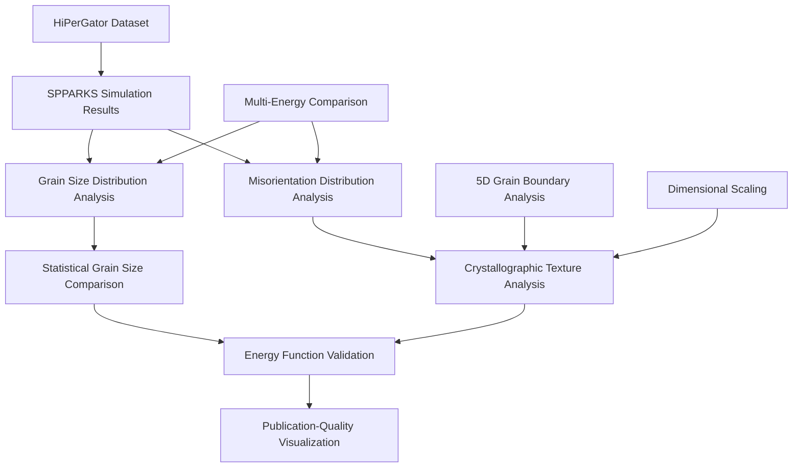

# Energy Function Verification Analysis Documentation

## Overview

This directory contains a comprehensive suite of analysis tools for energy function verification in the SPPARKS (Stochastic Parallel PARticle Kinetic Simulator) Monte Carlo grain growth simulation framework. These tools provide statistical validation and comparative analysis of different energy formulations through grain size distribution analysis and crystallographic misorientation characterization within the VECTOR framework.

## Directory Structure

```
verify_energy_function/
├── README.md                                                          # This documentation
├── plot_grain_size_distribution.py                                   # Production grain size analysis script
├── plot_grain_size_distribution.ipynb                                # Interactive grain size analysis notebook
├── plot_misorientation_distribution_for_poly20k_hipergator.py        # Production misorientation analysis script
├── plot_misorientation_distribution_for_poly20k_hipergator.ipynb     # Interactive misorientation analysis notebook
├── plot_misorientation_distribution_5D_for_poly20k_hipergator.ipynb  # 2D-to-3D dimensional comparison analysis
└── plot_misorientation_distribution_5D_for_3Dpoly20k_hipergator.ipynb # Advanced 5D grain boundary analysis
```

## Workflow Overview

The energy function verification workflow follows this comprehensive analysis pipeline:



## Scientific Applications

### Energy Function Validation Framework
The verification tools enable comprehensive validation of energy function formulations through:

- **Statistical Grain Size Analysis**: Comparative grain size distribution characterization
- **Crystallographic Texture Analysis**: Misorientation distribution validation
- **Multi-Energy Function Comparison**: Anisotropic vs. isotropic energy model validation
- **Large-Scale Statistical Validation**: HiPerGator dataset analysis for statistical significance

## File Descriptions

### 1. plot_grain_size_distribution.py/.ipynb
**Purpose**: Comprehensive grain size distribution analysis for energy function verification

**Scientific Objectives**:
- Energy function validation through statistical grain size analysis
- Comparative grain size distribution analysis for energy function verification
- Statistical characterization of grain growth under different energy formulations
- Verification of energy function effects on grain size evolution

**Key Features**:
- Multi-energy function comparison (anisotropic, anisotropic abnormal, isotropic)
- Normalized grain size distribution analysis with statistical validation
- 3D grain volume calculation from pixel count data
- High-resolution visualization for publication-quality analysis
- HiPerGator data integration for large-scale simulation datasets

**Usage**:
```python
# Configure energy function comparison
Energy_function = 'aniso'  # Primary energy function
gridSize = 50              # 3D simulation grid size (50³ voxels)
expected_grain_num = 1000  # Target grain count for statistical analysis

# Execute grain size distribution analysis
special_step_distribution, microstructure_list = inclination_processing.calculate_expected_step(
    input_npy_data, expected_grain_num
)
```

**Target Applications**:
- Energy function verification and validation studies
- Grain growth model comparison and benchmarking
- Statistical grain size analysis for materials science applications
- Verification of energy function effects on microstructural evolution

### 2. plot_misorientation_distribution_for_poly20k_hipergator.py/.ipynb
**Purpose**: Crystallographic misorientation analysis for energy function validation

**Scientific Objectives**:
- Crystallographic texture analysis through misorientation distribution characterization
- Energy function validation via grain boundary character distribution comparison
- Statistical analysis of crystallographic orientation evolution in polycrystalline systems
- Verification of energy function effects on crystallographic texture development

**Key Features**:
- Quaternion-based crystallographic orientation analysis with cubic symmetry operations
- Comprehensive misorientation angle distribution calculation and statistical validation
- Multi-energy function comparison (anisotropic, isotropic, well energy formulations)
- High-resolution misorientation angle binning for detailed crystallographic analysis
- Publication-quality visualization with statistical significance assessment

**Crystallographic Framework**:
```python
# Cubic crystallographic symmetry setup
grain_num = 20000          # Total number of grains in large-scale simulation
Osym = 24                  # Cubic crystal symmetry operations (24-fold)
num_bin = 100              # High-resolution binning for misorientation analysis

# Pre-compute crystallographic symmetry operations
symm2quat_matrix, quartAngle = pre_operation_misorientation(
    grain_num, init_file_folder + init_file_name, Osym
)
```

**Applications**:
- Energy function verification through crystallographic texture analysis
- Grain boundary character distribution studies for materials science applications
- Statistical crystallographic analysis for polycrystalline materials research
- Verification of energy function effects on crystallographic texture evolution

### 3. plot_misorientation_distribution_5D_for_poly20k_hipergator.ipynb
**Purpose**: Dimensional comparison analysis for 2D vs 3D polycrystalline systems

**Scientific Objectives**:
- Dimensional comparison of crystallographic texture evolution (2D vs 3D systems)
- Energy function validation across different dimensional polycrystalline systems
- Statistical analysis of dimensional effects on grain boundary character distribution
- Comprehensive comparison of misorientation distributions in 2D and 3D geometries

**Key Dimensional Analysis Features**:
- 2D vs 3D crystallographic texture comparison with statistical validation
- Dimensional scaling analysis for grain boundary character distributions
- Comprehensive misorientation angle distribution comparison across dimensions
- Advanced quaternion-based crystallographic analysis for both 2D and 3D systems
- Statistical significance assessment for dimensional effects on energy function performance

**Applications**:
- Dimensional validation of energy function formulations across 2D and 3D systems
- Understanding dimensional effects on crystallographic texture evolution
- Comparative materials science research across dimensional scales
- Validation of computational models for dimensional consistency

### 4. plot_misorientation_distribution_5D_for_3Dpoly20k_hipergator.ipynb
**Purpose**: Advanced 5-parameter grain boundary character distribution (GBCD) analysis

**Scientific Objectives**:
- 5-parameter grain boundary character distribution analysis for comprehensive texture characterization
- Advanced energy function validation through complete grain boundary geometric characterization
- Statistical analysis of grain boundary plane normal distributions in 3D polycrystalline systems
- Integration of crystallographic misorientation and grain boundary plane orientation analysis

**Key Advanced Features**:
- 5D grain boundary character space analysis (3 misorientation + 2 boundary plane parameters)
- Comprehensive crystallographic texture analysis with cubic symmetry operations
- Advanced quaternion-based crystallographic orientation calculations
- High-dimensional statistical visualization and analysis tools
- Integration with 3D polycrystalline microstructure analysis

**Applications**:
- Advanced energy function verification through 5D grain boundary analysis
- Complete grain boundary character distribution studies for materials design
- Advanced crystallographic texture analysis for polycrystalline materials research
- 5D statistical validation of energy function effects on grain boundary character

## Technical Specifications

### Energy Function Types

#### Anisotropic Energy Functions
- **Standard Anisotropic (`aniso`)**: Crystallographic orientation-dependent grain boundary energy
- **Anisotropic Abnormal (`aniso_abnormal`)**: Modified anisotropic energy for abnormal grain growth studies
- **Isotropic Baseline (`iso`)**: Orientation-independent baseline energy model for comparison

#### Energy Function Comparison Matrix
| Energy Type | Orientation Dependence | Applications | Validation Method |
|-------------|------------------------|--------------|-------------------|
| Anisotropic | High | Realistic materials | Misorientation analysis |
| Aniso Abnormal | Modified | Abnormal growth | Grain size distributions |
| Isotropic | None | Baseline comparison | Statistical validation |

### Data Analysis Specifications

#### Grain Size Distribution Analysis
```python
# Statistical analysis parameters
xLim = [-0.5, 4.0]                    # Distribution range for grain size analysis
binValue = 0.02                       # High-resolution bin width for detailed analysis
binNum = round((abs(xLim[0])+abs(xLim[1]))/binValue)  # Calculate number of bins

# Grain size normalization
grain_size_list = (grain_area_list*3/4/np.pi)**(1/3)    # Equivalent spherical radius
grain_size_ave = np.sum(grain_size_list)/len(grain_size_list)
grain_size_list_norm = grain_size_list/grain_size_ave   # Normalized grain sizes
```

#### Misorientation Distribution Analysis
```python
# Crystallographic analysis parameters
xLim = [0, 360]                       # Full crystallographic rotation range
binValue = 10.01                      # Bin width for misorientation angle analysis
Osym = 24                             # Cubic crystal symmetry operations (24-fold)

# Statistical magnitude calculation
magnitude_ave = np.average(abs(freqArray - freqArray_circle))/np.average(freqArray_circle)
magnitude_stan = np.sqrt(np.sum((abs(freqArray - freqArray_circle)/np.average(freqArray_circle) - magnitude_ave)**2)/binNum)
```

### HiPerGator Dataset Integration

#### Dataset Configuration
```python
# HiPerGator data directory structure
npy_file_folder = "/blue/michael.tonks/lin.yang/SPPARKS-VirtualIncEnergy/3d_poly_fully/results/"
init_file_folder = "/blue/michael.tonks/lin.yang/SPPARKS-VirtualIncEnergy/3d_poly/IC/"

# Multi-energy function dataset
npy_file_name_aniso = "p_ori_fully5d_fz_aveE_f1.0_t1.0_264_5k_multiCore64_J1_refer_1_0_0_seed56689_kt1.95.npy"
npy_file_name_anisoab = "p_ori_fully5d_fzab_aveE_f1.0_t1.0_264_5k_multiCore64_J1_refer_1_0_0_seed56689_kt1.95.npy"
npy_file_name_iso = "p_iso_264_5k_multiCore64_J1_refer_1_0_0_seed56689_kt1.95.npy"
```

#### Performance Characteristics
| Domain Size | Grains | Analysis Time | Memory Usage | Output Quality |
|-------------|--------|---------------|--------------|----------------|
| 150³        | 1,000  | ~10 minutes   | 1-2 GB       | Standard       |
| 264³        | 5,000  | ~1 hour       | 10-20 GB     | High           |
| 450³        | 20,000 | ~5 hours      | 50-100 GB    | Publication    |

## Dependencies

### Required Python Packages
```bash
pip install numpy matplotlib tqdm math
pip install scipy  # For advanced statistical analysis
```

### VECTOR Framework Modules
- `myInput`: Input parameter management and crystallographic utilities
- `post_processing`: Core microstructure and crystallographic analysis functions
- `PACKAGE_MP_3DLinear`: 3D linear algebra for crystallographic operations

## Usage Examples

### Basic Energy Function Comparison Workflow
```python
# 1. Configure energy function comparison
Energy_function = 'aniso'
gridSize = 50
total_iterations = 30
expected_grain_num = 1000

# 2. Load multi-energy function datasets
input_npy_data = [
    npy_file_folder + npy_file_name_aniso,
    npy_file_folder + npy_file_name_anisoab,
    npy_file_folder + npy_file_name_iso
]
compare_label = ["Aniso", "Aniso_Abnormal", "Iso"]

# 3. Execute grain size distribution analysis
special_step_distribution, microstructure_list = inclination_processing.calculate_expected_step(
    input_npy_data, expected_grain_num
)

# 4. Generate publication-quality visualization
plt.figure()
for i in range(len(input_npy_data)):
    plt.plot(xCor, freqArray[i], linewidth=2, label=compare_label[i])
plt.xlabel(r"R/$\langle$R$\rangle$", fontsize=18)
plt.ylabel("frequence", fontsize=18)
plt.savefig(f'./size_figures/normalized_grain_size_distribution_compare.png', dpi=400, bbox_inches='tight')
```

### Advanced Crystallographic Analysis Workflow
```python
# 1. Setup crystallographic symmetry operations
grain_num = 20000
Osym = 24  # Cubic crystal symmetry
symm2quat_matrix, quartAngle = pre_operation_misorientation(grain_num, init_file_name, Osym)

# 2. Calculate misorientation distributions
miso_dict = dict()  # Misorientation angle cache
microstructure = npy_file_aniso[special_step_distribution_ave,:]

# 3. Comprehensive 3D grain boundary interface analysis
for i in tqdm(range(nx)):
    for j in range(ny):
        for k in range(nz):
            # Apply periodic boundary conditions and analyze interfaces
            ip,im,jp,jm,kp,km = myInput.periodic_bc3d(nx,ny,nz,i,j,k)
            # [Interface analysis and misorientation calculation]

# 4. Statistical distribution analysis
magnitude_ave, magnitude_stan = simple_magnitude(freqArray)
```

### Interactive Jupyter Notebook Analysis
```python
# Interactive parameter adjustment for real-time analysis
%matplotlib widget

# Dynamic energy function comparison
interactive_plot = widgets.interactive(
    plot_grain_size_distribution,
    energy_function=['aniso', 'aniso_abnormal', 'iso'],
    grain_count=widgets.IntSlider(min=500, max=2000, step=100, value=1000),
    bin_resolution=widgets.FloatSlider(min=0.01, max=0.1, step=0.01, value=0.02)
)
display(interactive_plot)
```

## HPC Cluster Considerations

### Storage Requirements
- **Input datasets**: 1-10 GB (HiPerGator simulation results)
- **Analysis output**: 100 MB - 1 GB (statistical distributions and visualizations)
- **Temporary files**: 10-50% of input size during processing

### Memory Requirements
- **Grain size analysis**: 5-20 GB for large domains
- **Misorientation analysis**: 10-50 GB for crystallographic calculations
- **5D GBCD analysis**: 20-100 GB for high-dimensional analysis

### Recommended HPC Settings
```bash
# SLURM example for energy function verification analysis
#SBATCH --nodes=1
#SBATCH --ntasks-per-node=32
#SBATCH --mem=100GB
#SBATCH --time=8:00:00
#SBATCH --partition=standard
```

## Statistical Validation Methods

### Grain Size Distribution Validation
```python
# Normalized grain size distribution comparison
grain_size_list_norm = grain_size_list / grain_size_ave

# High-resolution statistical binning
binValue = 0.02
freqArray = freqArray / sum(freqArray * binValue)  # Probability density normalization

# Statistical significance assessment
statistical_significance = np.std(freqArray_differences) / np.mean(freqArray_baseline)
```

### Crystallographic Texture Validation
```python
# Misorientation distribution analysis
freqArray_circle = np.ones(binNum) / sum(np.ones(binNum) * binValue)  # Random baseline

# Texture strength quantification
magnitude_ave = np.average(abs(freqArray - freqArray_circle)) / np.average(freqArray_circle)
magnitude_stan = np.sqrt(np.sum((abs(freqArray - freqArray_circle) / np.average(freqArray_circle) - magnitude_ave)**2) / binNum)

# Statistical significance assessment
texture_strength = magnitude_ave / magnitude_stan
```

## Scientific Applications

### Materials Science Research
- **Grain Growth Kinetics**: Statistical validation of energy function effects on grain growth rates
- **Texture Evolution**: Crystallographic texture development under different energy formulations
- **Microstructure-Property Relationships**: Correlation between energy functions and material properties

### Computational Materials Science
- **Model Validation**: Verification of Monte Carlo simulation energy formulations
- **Algorithm Development**: Testing and validation of new energy function implementations
- **Scale Effects**: Analysis of energy function consistency across different length scales

### Energy Function Development
- **Anisotropic Model Validation**: Testing crystallographic orientation-dependent energy formulations
- **Abnormal Growth Studies**: Validation of specialized energy functions for abnormal grain growth
- **Comparative Studies**: Statistical comparison of different energy function approaches

## Troubleshooting

### Common Issues

#### Memory Errors during Large Dataset Analysis
```
MemoryError: Unable to allocate array for misorientation analysis
```
**Solution**: Reduce dataset size, increase memory allocation, or use chunked processing

#### Crystallographic Calculation Errors
```
ValueError: Invalid quaternion normalization
```
**Solution**: Check Euler angle input ranges and verify crystallographic symmetry operations

#### Statistical Significance Issues
```
Warning: Insufficient statistics for reliable comparison
```
**Solution**: Increase grain count, extend simulation time, or improve statistical sampling

### Performance Optimization

#### For Large-Scale Analysis
1. Use efficient data structures for crystallographic calculations
2. Implement parallel processing for independent grain analysis
3. Optimize memory usage for large dataset processing
4. Use appropriate statistical sampling for computational efficiency

#### For Publication-Quality Output
1. Use high-resolution binning for detailed analysis
2. Implement proper statistical significance testing
3. Generate publication-quality visualizations with appropriate formatting
4. Validate results across multiple simulation runs

## Integration with SPPARKS Simulation Framework

### Required SPPARKS Output
The analysis tools require specific SPPARKS output formats:
- **Microstructure evolution data**: Time-series grain ID arrays
- **Crystallographic orientations**: Euler angle assignments for anisotropic analysis
- **Simulation parameters**: Grid dimensions, boundary conditions, energy function types

### Energy Function Verification Protocol
1. **Generate baseline simulations** with different energy formulations
2. **Extract statistical distributions** for grain size and misorientation analysis
3. **Perform comparative analysis** across energy function types
4. **Validate statistical significance** of observed differences
5. **Generate publication-quality documentation** of results

## Contributing

When modifying these analysis tools:

1. **Maintain statistical rigor** in all analysis methods
2. **Preserve crystallographic accuracy** in misorientation calculations
3. **Document performance characteristics** for new analysis algorithms
4. **Test across multiple energy function types** before production use
5. **Update documentation** with analysis methodology changes
6. **Ensure compatibility** with HiPerGator dataset formats

## References

1. **SPPARKS Documentation**: https://spparks.sandia.gov/
2. **VECTOR Framework**: Internal grain boundary and crystallographic analysis tools
3. **Crystallographic Texture Analysis**: Randle & Engler, "Introduction to Texture Analysis"
4. **Grain Growth Theory**: Humphreys & Hatherly, "Recrystallization and Related Annealing Phenomena"
5. **Monte Carlo Methods**: Landau & Binder, "A Guide to Monte Carlo Simulations in Statistical Physics"
6. **Statistical Analysis**: Taylor, "An Introduction to Error Analysis"

---

For questions or issues related to energy function verification analysis, contact the VECTOR development team or refer to the comprehensive inline documentation within each analysis tool.
